https://stanford-cs336.github.io/spring2025/

# Lec1

basics, systems, scaling laws, data, alignment

* Data processing: avoid wasting precious compute updating on bad / irrelevant data
* Tokenization: working with raw bytes is elegant, but compute-inefficient with today's model architectures.
* Model architecture: many changes motivated by reducing memory or FLOPs (e.g., sharing KV caches, sliding window attention)
* Training: we can get away with a single epoch
* Scaling laws: use less compute on smaller models to do hyperparameter tuning
* Alignment: if tune model more to desired use cases, require smaller base models

### Tokenization

convert between strings and sequences of integers (tokens)

#### **Byte-Pair Encoding (BPE) tokenizer**

#### Byte-based tokenization

 Unicode encoding is UTF-8 (compression rate 1, bad)

#### Word-based tokenization

#### Byte Pair Encoding (BPE)

https://zhuanlan.zhihu.com/p/448147465

Basic idea: train the tokenizer on raw text to automatically determine the vocabulary.

```python
# 创建一个分词器实例
tokenizer = BPETokenizer(params)

# 原始文本
string = "the quick brown fox"  # @inspect string

# 对文本进行编码，得到索引序列
indices = tokenizer.encode(string)  # @inspect indices

# 将索引序列解码回文本
reconstructed_string = tokenizer.decode(indices)  # @inspect reconstructed_string

# 验证解码后的字符串是否与原始字符串一致
assert string == reconstructed_string
```

### Variants:

Activation functions: ReLU, SwiGLU

Positional encodings: sinusoidal, RoPE

Normalization: LayerNorm, RMSNorm

Placement of normalization: pre-norm versus post-norm

MLP: dense, mixture of experts

Attention: full, sliding window, linear

Lower-dimensional attention: group-query attention (GQA), multi-head latent attention (MLA)

State-space models: Hyena

### Training

Optimizer (e.g., AdamW, Muon, SOAP)

Learning rate schedule (e.g., cosine, WSD) 

Batch size (e..g, critical batch size)

Regularization (e.g., dropout, weight decay)

Hyperparameters (number of heads, hidden dimension): grid search

### Inference

Includes **prefill and decode**

Prefill (similar to training): tokens are given, can process all at once (compute-bound)

Decode: need to generate one token at a time (memory-bound)

* Use cheaper model (via model pruning, quantization, distillation)

* Speculative decoding: use a cheaper "draft" model to generate multiple tokens, then use the full model to score in parallel (exact decoding!)

* Systems optimizations: KV caching, batching

### scaling laws

Goal: do experiments at small scale, predict hyperparameters/loss at large scale

given a FLOPs budget (C), use **bigger model (N) or train on more tokens**

D = 20N (like 1.4B parameter model should be trained on 28B tokens)

> 1. 提前预测最终模型效果，知道每次训练的大概能到什么程度，要是不及预期可以根据预算再进行调整
> 2. 在小尺寸模型上做置信的实验，进行数据、算法策略验证，降低实验的时间、资源成本
> 3. 在真正的大规模预训练中，随时监测模型效果是否符合预期

### Evaluation

### Data curation

### Data processing

### Supervised finetuning (SFT)

Supervised learning: fine-tune model to maximize p(response | prompt)

# Lec 2

* **primitives needed to train a model**
* **go bottom-up from tensors to models to optimizers to the training loop.**
* **pay close attention to efficiency**

### training

```python
note_about_randomness()  
data_loading()

optimizer()
train_loop()
checkpointing()
mixed_precision_training()
```

##### `note_about_randomness()`

记录或控制随机性，保证训练的 可重复性（Reproducibility）

```python
import torch
import random
import numpy as np

def note_about_randomness():
    torch.manual_seed(42)
    random.seed(42)
    np.random.seed(42)
```

##### `data_loading()`

`torch.utils.data.DataLoader`

* 加上 `num_workers` 参数，开启多线程加载
* **预处理 pipeline：**
  - 数据增强（augmentation）
  - tokenization / normalization
  - batch 拼接
  - pin_memory 加速 GPU 内存传输

##### `optimizer()`

* 定义优化器（如 SGD, Adam），负责根据 loss 更新模型参数
* `optimizer = torch.optim.Adam(model.parameters(), lr=1e-3)`

##### `train_loop()`

```python
for batch in dataloader:
    outputs = model(batch)
    loss = loss_fn(outputs, labels)
    loss.backward()
    optimizer.step()
    optimizer.zero_grad()
```

这里`loss.backward()`：只是把梯度算出来，暂时存储在每个参数的 `.grad` 属性里。

`optimizer.step()`：读取 `.grad`，做优化算法的参数更新。

如果不清零，第二次 `.backward()` 会把梯度叠加到第一次的基础上，导致错误。``optimizer.zero_grad()`清空参数的 `.grad` 属性

* 分布式训练（如 DDP）时，需在这里调用同步/异步通信

##### `checkpointing()`

保存训练的中间状态

- 模型参数
- 优化器状态
- 学习率调度器状态
- 当前 epoch/step

```python
torch.save({'model': model.state_dict(),
            'optimizer': optimizer.state_dict()}, 'checkpoint.pth')
```

##### `mixed_precision_training()`

```python
from torch.cuda.amp import GradScaler, autocast

scaler = GradScaler()
with autocast():
    outputs = model(batch)
    loss = loss_fn(outputs, labels)

scaler.scale(loss).backward()
scaler.step(optimizer)
scaler.update()
```

### **FLOPs**

70B 15T token

```python
#total_flops = 6 * N_params * N_tokens
total_flops = 6*70e9*15e12
```

1 次 **前向传播**（forward pass）大概 ≈ 2 × 参数数量

1 次 **反向传播**（backward pass）大概 ≈ 4 × 参数数量

这里4就是需要计算两次矩阵乘法

一个计算梯度权重，一个计算梯度的输入

```python
bytes_per_parameter = 4 + 4 + (4 + 4) # parameters, gradients, optimizer state
```

use float32 for parameters and gradients, also use bf16 for parameters and gradients (2 + 2) and keep an extra float32 copy of the parameters (4). This doesn't save memory, but is faster.

activations are not accounted for

H100s support two variants of FP8: E4M3 (range [-448, 448]) and E5M2  ([-57344, 57344])

## tensor

### `tensors_basics()`

Tensors are the basic building block for storing everything: parameters, gradients, optimizer state, data, activations.

```python
x=torch.tensor([[1.,2,3],[4,5,6]])
x=torch.zeros(4,8)
x=torch.ones(4,8)
x=torch.randn(4,8)

x=torch.empty(4,8)
#set the value later
nn.init.trunc_normal_(x,mean=0,std=1,a=-2,b=2) #截断正态分布初始化函数，a截断下界，b截断上界
```

### `tensors_memory()`

**Float32**, fp32 is the default.  (4bytes)

1 sign + 8 exponent + 23 fractions

**Float16** (2bytes)

fp16 5exp

1 sign + 5 exponent + 10 fractions

```
x = torch.tensor([1e-8], dtype=torch.float16)  # @inspect x
assert x == 0  # Underflow!
```

表示非常小的数时的限制，即**数值下溢（underflow）**问题。

**bfloat16**

1 sign + 8 exponent + 7 fractions

没有underflow了

bf16 8exp

**Fp8**

### `tensors_on_gpus()`

tensor stores in CPU memory and need to move to GPU memory

```python
x.device == torch.device("cpu")
torch.cuda.is_available()
num_gpus=torch.cuda.device_count()
for i in range(num_gpus):
    properties = torch.cuda.get_device_properties(i)
    
memory_allocated = torch.cuda.memory_allocated()
y = x.to("cuda:0")
y.device = torch.device("cuda",0)
```

### `tensor_operations()`

#### `tensor_storage()`

```python
x.stride(dim)
# 在 PyTorch 中，x.stride(dim) 表示：在维度 dim 上移动一步（索引 +1）时，在底层内存中要跳过多少个元素。
```

#### `tensor_slicing()`

Many operations simply provide a different view of the tensor.

This does not make a copy, and therefore mutations in one tensor affects the other.

```python
x = torch.tensor([[1., 2, 3], [4, 5, 6]])

y = x[0] # row 0
assert torch.equal(y, torch.tensor([1., 2, 3]))
assert same_storage(x, y)

y = x[:,1] #column 1
assert torch.equal(y, torch.tensor([2, 5]))
assert same_storage(x, y)

y = x.view(3, 2) # @inspect y
assert torch.equal(y, torch.tensor([[1, 2], [3, 4], [5, 6]]))
assert same_storage(x, y)

y = x.transpose(1, 0) # @inspect y
y.view(2,3)
assert torch.equal(y, torch.tensor([[1, 4], [2, 5], [3, 6]]))
assert same_storage(x, y)

# One can enforce a tensor to be contiguous first
y = x.transpose(1, 0).contiguous().view(2, 3) # @inspect y
assert not same_storage(x, y)
```

#### `tensor_elementwise()`

```python
# triu takes the upper triangular part of a matrix.
x = torch.ones(3, 3).triu()
# causal attention mask
```

#### `tensor_matmul()`

#### `tensor_einops()`

Einops is a library for manipulating tensors

```python
z = einsum(x, y, "batch seq1 hidden, batch seq2 hidden -> batch seq1 seq2")
# Or can use ... to represent broadcasting over any number of dimensions
z = einsum(x, y, "... seq1 hidden, ... seq2 hidden -> ... seq1 seq2") 

x: Float[torch.Tensor, "batch seq hidden"] = torch.ones(2, 3, 4)
y = x.mean(dim=-1)
y = reduce(x, "... hidden -> ...", "sum")

# rearrange
x: Float[torch.Tensor, "batch seq total_hidden"] = torch.ones(2, 3, 8)
# ...where total_hidden is a flattened representation of heads * hidden1
w: Float[torch.Tensor, "hidden1 hidden2"] = torch.ones(4, 4)
# Break up total_hidden into two dimensions (heads and hidden1)
x = rearrange(x, "... (heads hidden1) -> ... heads hidden1", heads=2) 
# Perform the transformation by w:
x = einsum(x, w, "... hidden1, hidden1 hidden2 -> ... hidden2") # @inspect x
# Combine heads and hidden2 back together:
x = rearrange(x, "... heads hidden2 -> ... (heads hidden2)") # @inspect x
```

**A100 has a peak performance of 312 teraFLOP/s**

```
assert a100_flop_per_sec == 312e12
```

**H100 has a peak performance of 1979 teraFLOP/s with sparsity, 50% without**

```
assert h100_flop_per_sec == 1979e12 / 2
```

### **Model FLOPs utilization (MFU)**

Definition: (actual FLOP/s) / (promised FLOP/s) [ignore communication/overhead]

mfu = actual_flop_per_sec / promised_flop_per_sec # @inspect mfu

**Usually, MFU of >= 0.5 is quite good (and will be higher if matmuls dominate)**

**comparing bfloat16 to float32, the actual FLOP/s is higher**

Putting it togther:

Forward pass: 2 (# data points) (# parameters) FLOPs

Backward pass: 4 (# data points) (# parameters) FLOPs

Total: 6 (# data points) (# parameters) FLOPs

### data_loading

`orig_data.tofile("data.npy")`

Use memmap to lazily load only the accessed parts into memory.

`data = np.memmap("data.npy", dtype=np.int32)`

By default, CPU tensors are in paged memory. We can explicitly pin

x = x.pin_memory()

**This allows us to copy** x **from CPU into GPU asynchronously.**

`x = x.to(device, non_blocking=True)`

This allows us to do two things in parallel (not done here):

Fetch the next batch of data into CPU

Process x on the GPU.

**Let's define the AdaGrad optimizer**

* momentum = SGD + exponential averaging of grad

* AdaGrad = SGD + averaging by grad^2

* RMSProp = AdaGrad + exponentially averaging of grad^2

* Adam = RMSProp + momentum

# Lec 3

### Pre-vs-post norm

just use Pre norm!!!

post norm will be unstable and have to do some careful lr warm-up style things

Grok and gamma 2 add layer norm after FFN

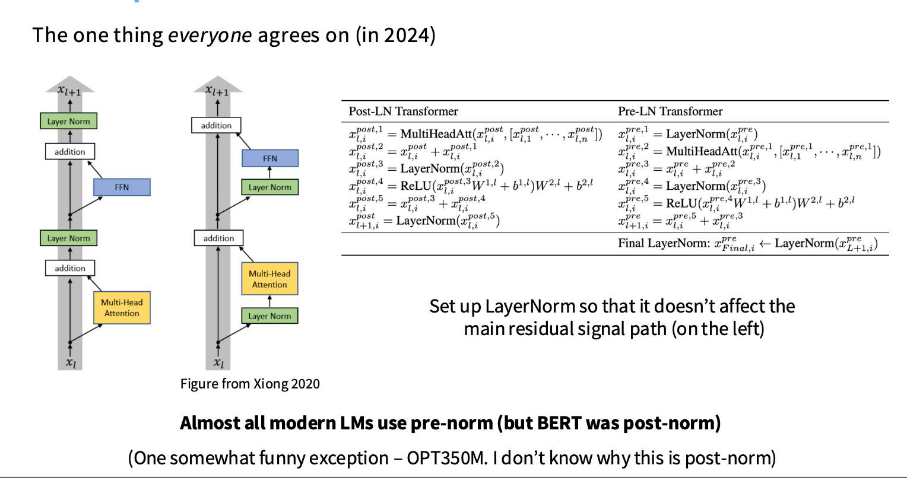

> why layer norm in the residual path bad?
>
> the residual gives you the identity connection from top to bottom, this makes gradient propagation very easy. Put layer in the residual might mess that kind of gradient behavior

### LayerNorm vs RMSNorm

nearly all the model use RMSNorm

Modern explanation – it’s faster (and just as good).

• Fewer operations (no mean calculation)

• Fewer parameters (no bias term to store)

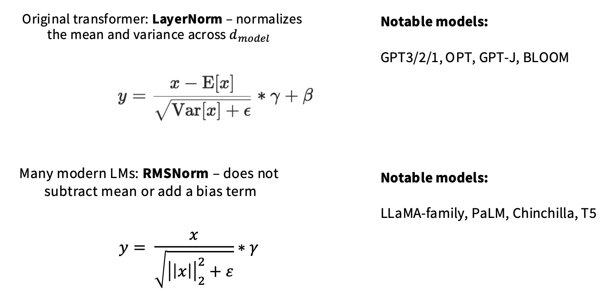

important to think about the memory, not just about FLOPS

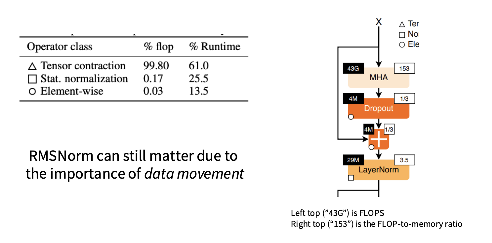

### dropping bias terms

Most modern transformers don’t have bias terms.

$FFN(x)=\sigma(xW_1)W_2$

Reasons: memory (similar to RMSnorm) and optimization stability

### recap

Basically everyone does pre-norm.

* Intuition – keep the good parts of residual connections

* Observations – nicer gradient propagation, fewer spike

* Some people add a second norm outside the residual stream (NOT post-norm)

Most people do RMSnorm

* In practice, works as well as LayerNorm

* But, has fewer parameters to move around, which saves on wallclock time

* People more generally drop bias terms since the compute/param tradeoffs are not great.

### Activations

Llama, PaLM,T5 v1.1, most models post 2023 use SwiGLU/GeGLU

SwiGLU (swish is 𝑥 ∗ sigmoid(𝑥))

> Note: Gated models use smaller dimensions for the 𝑑𝑓𝑓 by 2/3???

可以把 **gating activation（门控制激活）** 理解成：

> **网络在每个位置用一个门（gate）来决定：信息要放大、通过、还是被压下去。**

它不是只做“激活”，而是在激活 *前后* 加上一个可学习的“门”，让模型动态控制流经的信号量。

下面用你能最快抓住直觉的方式解释。

y = gate(x) ⊙ activation(x)

门（gate）一般是：

- sigmoid
- swish
- GLU gate: linear(x1) + sigmoid(x2)
- 或者更复杂如 SwiGLU, GeGLU, ReGLU  

### consensus hyperparameter 1

There are two dimensions that are relevant – the feedforward dim (𝑑𝑓𝑓) and model dim (𝑑𝑚𝑜𝑑𝑒𝑙 ). What should their relationship be?

$d_{ff} = 4d_{model}$

This is almost always true. There’s just a few exceptions.

Remember that GLU variants scale down by 2/3rd. This means most GLU variants have 𝑑𝑓𝑓 =8/3𝑑𝑚𝑜𝑑𝑒𝑙 .

The ‘default’ choices of 𝑑𝑓𝑓 = 4𝑑𝑚𝑜𝑑𝑒𝑙 and GeLU 𝑑𝑓𝑓 = 2.66𝑑𝑚𝑜𝑑𝑒𝑙 have worked well for nearly all modern LLMs.

### Aspect ratios

𝒅𝒎𝒐𝒅𝒆𝒍/𝒏𝒍𝒂𝒚𝒆𝒓

Extremely deep models are harder to parallelize and have higher latency

### vocabulary sizes

Monolingual models – 30-50k vocab

Multilingual / production systems 100-250k

### Dropout and other regularization

pretraining dont need regularization?

pretraining usually need one epoch

There is a lot of data (trillions of tokens), more than parameters., SGD only does a single pass on a corpus (hard to memorize)

drop out 用的少了，一般用weight decay? Intuition violation!

> #### weight decay
>
> 传统梯度下降更新是：
> $$
> w \leftarrow w - \eta \cdot \nabla L(w)
> $$
> 加入 weight decay（L2 正则）后：
> $$
> w \leftarrow w - \eta \cdot (\nabla L(w) + \lambda w)
> $$
> 也就是多加了一个项：
> $$
> \lambda w
> $$
> 这就等价于每次都把权重往 0 拉一点。
>
> 因为“大的参数”容易导致模型更复杂、更加拟合训练数据。 Weight Decay 让模型更平滑、更简单，从而提高泛化能力。可以防止过拟合

Many older models used dropout during pretraining

Newer models (except Qwen) rely only on weight decay

#### Why weight decay LLMs

优化损失函数提升性能

It’s not to control overfitting

为什么不用drop out了呢？是因为单epoch情况下没有必要

### Stability tricks

Softmaxes – can be ill-behaved due to exponentials / divison by zero

原本的softmax 就是Z(x) = $\Sigma e^{x_i}$

然后z loss 就是在loss function上

它是一个额外加到 loss 上的小项，形式如下：减去
$$
L_{z} = \alpha \cdot \left( \sum_i z_i^2 \right)
$$

#### Softmax

假设模型输出 logits $\mathbf{z} = [z_1, z_2, \dots, z_V]$（Vocab size 为 $V$）：
$$
\text{softmax}(z_i) = \frac{e^{z_i}}{\sum_{j=1}^V e^{z_j}}
$$
通常训练的目标是 **交叉熵 loss**：
$$
L_{\text{CE}} = - \log \frac{e^{z_{y}}}{\sum_j e^{z_j}} = -z_y + \log \sum_j e^{z_j}
$$

#### z loss

$$
L_z = \alpha \, s^2 = \alpha \, (\log \sum_i e^{z_i})^2
$$

训练总 loss：
$$
L = L_{\text{CE}} + L_z = -z_y + \log \sum_j e^{z_j} + \alpha (\log \sum_j e^{z_j})^2
$$
优化成功的话，logZ(x)恒等于0

### QK norm

The query and keys are Layer (RMS) normed before going into the softmax operation.

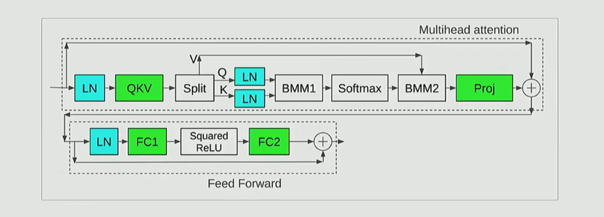

inference 也会保留

### Attention heads

GQA / MQA : Saving inference costs by reducing the number of heads

#### Multi-Query Attention (MQA) 

have multiple queries, but just one dimension for keys and values

#### Does MQA hurt? 

Small PPL hit w/ MQA [Shazeer 2019] 

#### GQA

Don’t go all the way to one dimension of KV – have fewer dims

Simple knob to control expressiveness (key-query ratio) and inference efficiency

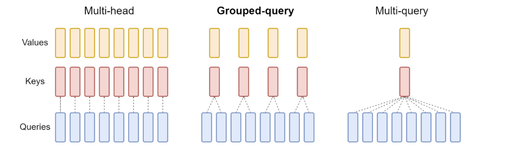

### Sparse window attention

Attending to the entire context can be expensive (quadratic).

Build sparse / structured attention that trades off expressiveness vs runtime (GPT3)

### sliding window attention

Just use the main part of the strided pattern – let depth extend effective context (Mistral)

简单说sparse更灵活

**局部 + 全局**（Longformer/BigBird）

- 局部是固定窗口
- 全局 token 可以 attend 所有位置

**随机稀疏**（Reformer、一些 block-sparse Transformer）

- 每个 token 的注意力位置部分随机选取
- 用于长序列时降低复杂度

### Current standard trick – interleave ‘full’ and ‘LR’ attention

From Cohere Command A – Every 4th layer is a full attention

- 大部分层（3/4）使用 **滑动窗口注意力**（高效，计算量小）
- 每隔 3 层，第 4 层使用 **全注意力**（捕捉全局信息）

Long-range info via NoPE, short-range info via RoPE + SWA.

# Lec 4

### Routing function

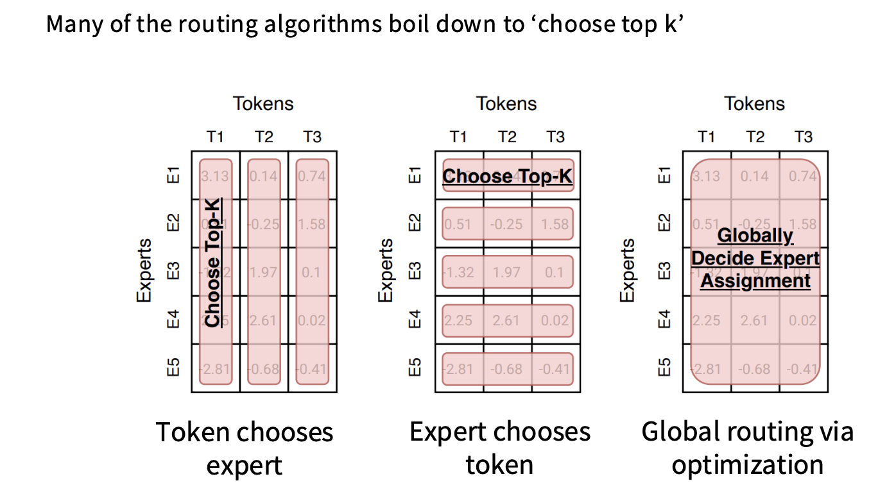

Token chooses experts 相当于就是一个word vector，乘一个W matrix，然后Sigmoid可以得到score了，这一一般K=2，

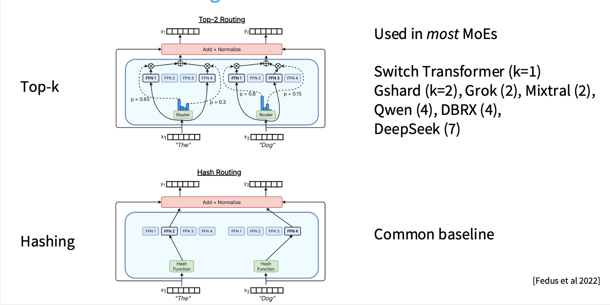

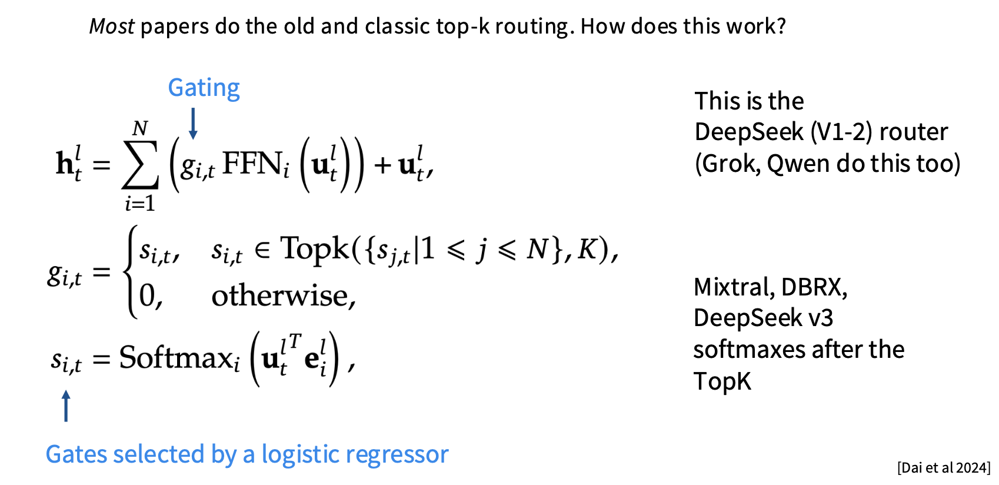

#### Shared Experts DeepSeekMOE

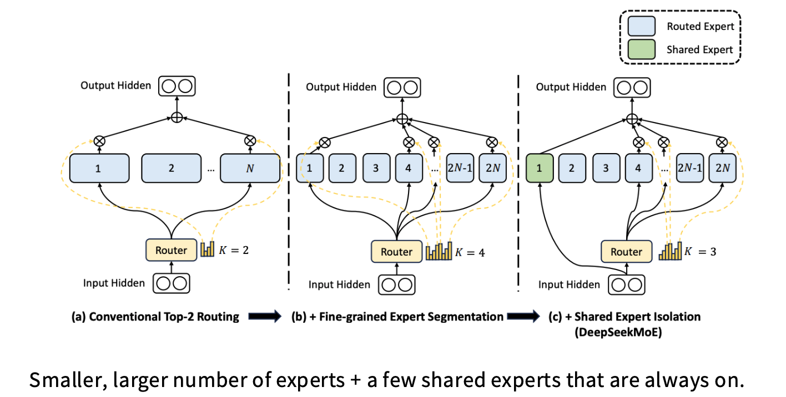

分成粒度更小的Experts，还有shared Experts

### Expert sizes

Fine-grained ratio 就是和正常size对比的比例，比如 1/14，routed 就是总共的experts的个数，activate就是真正使用的个数，shared就是都使用，不参与路由的个数

### How do we train MoEs

Major challenge: we need sparsity for training-time efficiency…

But sparse gating decisions are not differentiable!

简单说就是希望高效训练只激活部分experts，但是有效学习需要所有参数都能得到梯度更新

```
# 理想中的稀疏路由（不可微分）
expert_weights = router(input_tensor)  # 例如：[0.1, 0.8, 0.05, 0.05]
selected_expert = argmax(expert_weights)  # 选择 index=1
output = experts[selected_expert](input_tensor)  # 只使用专家1
```

这里的 `argmax()` 或 `top-k` 操作是**不可微分**的！

不可微分是因为router是discrete的

#### Solutions?

1. Reinforcment learning to optimize gating policies
2. Stochastic perturbations
3. Heuristic ‘balancing’ losses. **DeepSeek**

这里RL就是

- 将路由选择视为**决策问题**
- 使用策略梯度方法优化路由决策
- RL is the ‘right solution’ but gradient variances and complexity means it’s not widely used

Stochastic 通过注入可微分的噪声，使离散选择近似可微

Heruistic添加额外的损失函数来间接引导路由决策，负载均衡损失（Load Balancing Loss）

systems efficiency requires that we use experts evenly

如果忽略别的constrains，存在一个问题是tokens router to one experts and end up in local minimum，也就是一个experts很好，别的experts啥都不会

所以loss balancing可以避免这种local minimum

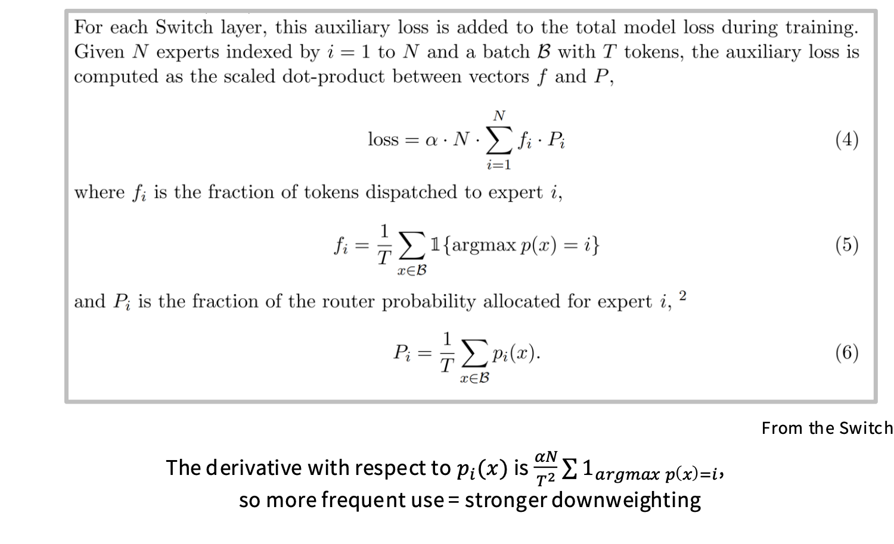

这里loss就是遍历整个experts，fi就是每个token分配到expert i的概率，是一个probability vector

Pi是路由到expert i 的概率，Pi路由，fi就是Top-K做出的实际路由

也就是获得越多的token，gradient下推的越厉害


不仅对于expert还有不同的device进行shard

#### DeepSeek v3 variation – per-expert biases

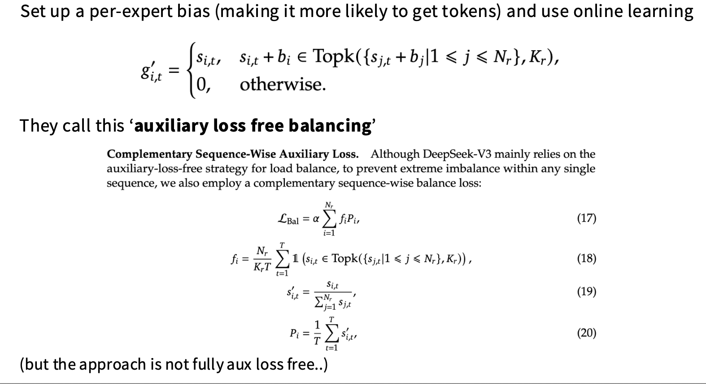

这里si,t是softmax的输出，bi就是一个fudge factor score for each expert

如果获取tokens不够多，就是增加bi来获得更多token

训练学习bi，如果太少tokens就bi加上gamma，太多就减去gamma，experts变得不attractive

### upcycling

把dense MLP当成MOE

DeepSeek MoE v2 vs v1

New things: Top-M device routing

V1 每个token → Router → 选择top-k个专家 → 激活这些专家

- 专家可能分布在不同的设备（GPU）上
- **跨设备通信**：token需要在设备间传输，产生昂贵的通信开销

**V2的核心创新**：**先在设备级别做路由，再在设备内部做专家路由**

```
传统MoE V1：
token → Router → 选择专家(可能跨设备) → 跨设备通信 → 计算

MoE V2 Top-M Device Routing：
token → Device Router → 选择top-M个设备 → 
    └→ 在每个选中设备内：Expert Router → 选择专家 → 计算
```

V3：**Sigmoid+Softmax topK + topM**

softmax强制所有专家的概率和为1，这假设每个token**必须**使用专家，但有些token可能不需要任何专家！

1. **稀疏性控制更灵活**：sigmoid允许某些专家得分为0
2. **两阶段筛选**：先宽选(top-M)，再精选(top-K)，减少错误选择
3. **自适应专家数量**：可以根据token复杂度动态选择专家数量

### MLA

Basic idea: express the Q, K, V as functions of a lower-dim, ‘latent’ activation

Benefits: when KV-caching, we only need to store 𝑐𝑡

𝐾𝑉, which can be much smaller.

𝑊𝑈𝐾 can be merged into the Q projection

(they also compress queries, for memory savings during training)

Complexity: rope conflicts with MLA-style caching

### MTP

Have small, lightweight models that predict multiple steps ahead

# Lec 5

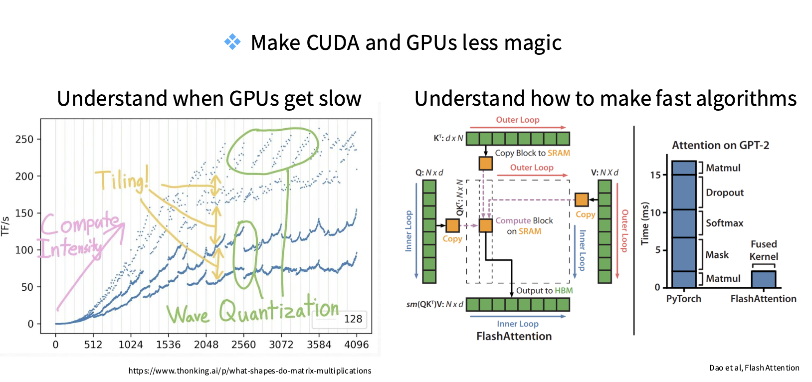

Part 1: GPUs in depth – how they work and important parts

Part 2: Understanding GPU performance

Part 3: Putting it together – unpacking FlashAttention

### scale law

Parallel scale

CPU large control branch prediction, GPU have little control logic orchestrating

CPUs optimize for latency (each thread finishes quickly)

GPUs optimize for throughput (total processed data)

GPUs have many SM (streaming multiprocessors) that independently execute ‘blocks’ (jobs).

Each SM further contains many SPs (streaming processor) that can execute ‘threads’ in parallel

L1 and shared memory inside of SM, so it's quite fast

### Side thread TPU

TPU是Tensor Processing Unit，是专门加速机器学习的，有专门的MXU(matrix multiplication), VPU(data load in MXU, activation), 

### roofline model

### make GPUs go fast

1. Control divergence (not a memory bottleneck..)

2. Low precision computation

3. Operator fusion

4. Recomputation

   也就是一个读中间计算值，一个就从头重新计算，通过cpu compute换memory bound，trade off

   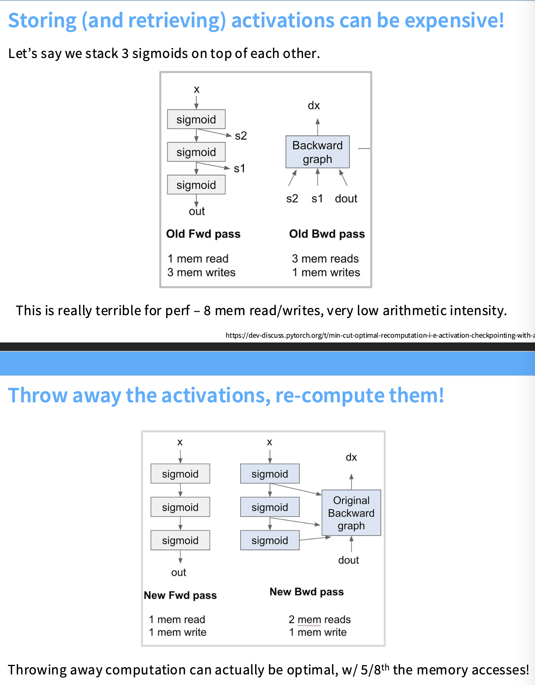

5. Coalescing memory

6. Tiling

   tile size T, each input is read N/T times from global memory, factor of T reduction in global memory access.

### Complexities with tiling

Tile sizes may not divide the matrix size and lead to low utilization

like 256*256, tile 128 has 4 tiles, then 257\*256 tile 128 has 6 tiles

### Complexities with tiling 2 – memory alignment

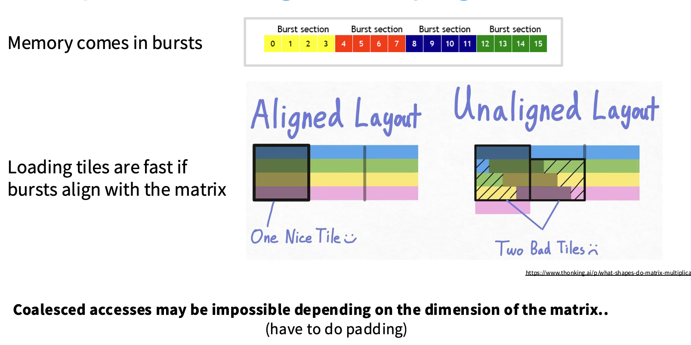

如果多了一个就double load了，可以padding

### tiling

Tiling has a major impact through alignment.

### wave quantization

periodic behavior 1792 to 1793

Using a tile size of 256 × 128, there are 1792/256=7, 1792/128=14, 128= 7 × 14 = 98 tiles

1793, 1793/256=8, 1793/128=15, 8*15=120 tiles

An A100 has 108 SMs, so it cannot execute all 120

so it will execute 108 sms first then rest of then 

### making ML workloads go fast

Reduce memory accesses

* Coalescing
* Fusion

Move memory to shared memory

* Tiling

Trade memory for compute/accuracy

* Quantization

* Recomputation

### Flash Attention

> **FlashAttention = IO-aware tiled attention + fused kernel + online (incremental) softmax**

它解决的不是算力问题，而是 **HBM 带宽瓶颈**。

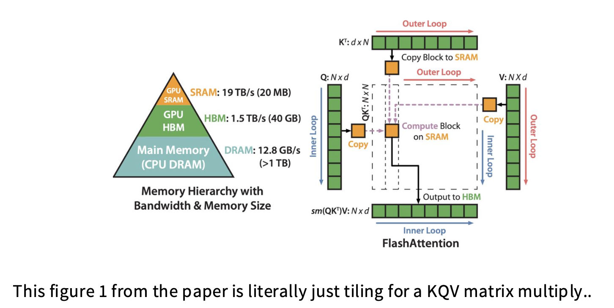

```text
HBM (global memory)   ← 慢 / 大
L2 cache
Shared memory (SRAM) ← 快 / 小
Registers             ← 更快
```

HBM 每个tile从HBM读一次，QKV最初存放位置，SRAM tile里的QKV，tile里的partial softmax state，tile里output accumulation

fusion是不把中间结果（QK、softmax score）写回 HBM，所有中间步骤都在一个 kernel 里，在 SRAM / registers 完成

Kernel Fusion+tiling(tiling for KQV matrix multiply, incremental softmax)

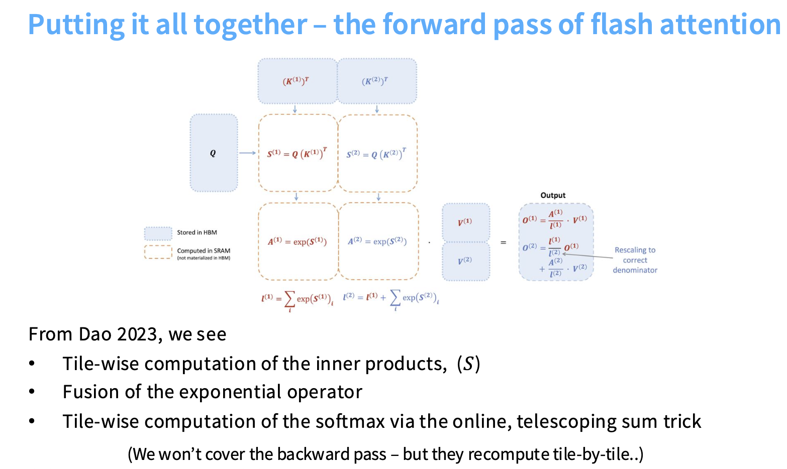

# Lec 6

A100 108 SMs

* DRAM [A100: 80GB] - big, slow

* L2 cache [A100: 40MB]

* L1 cache [A100: 192KB per SM] - small, fast

Thread, Thread block, Grid

> Why thread blocks? Shared memory.
>
> Intuition: group f(i)'s that read similar data together
>
> Threads within a thread block have shared memory (as fast as L1 cache) [A100: 164KB]
>
> Can synchronize threads (for reading/writing) within a block (but not across blocks)

32 Threads into one wave, and the problem: last wave has fewer thread blocks, leaving some SMs idle (low occupancy).

Wave quantization: make number of thread blocks divide # SMs.

Rule of thumb: number of thread blocks should be >= 4x # SMs 经验法则，线程总数应该大于等于 4倍SMs

### **Arithmetic intensity: # FLOPs / # bytes**

* If high, operation is compute-bound (good)

* If low, operation is memory-bound (bad)

General rule: matrix multiplication is compute-bound, everything else is memory-bound

计算性能拓展速度远大于内存性能扩展速度 scaling

most of the cases, the computations are going to end up being memory bound. 也就受限于内存限制

因为Matrix multiply是compute bound的，如果经过优化转为memory bound因此目标减少memory bound或者它的影响

### IMPORTANT: benchmark/profile your code!

#### benchmark()

```python
def benchmark(
    description: str,
    run: Callable,
    num_warmups: int = 1,
    num_trials: int = 3,
):
    """
    Benchmark `run` by executing it multiple times and returning the mean latency (ms).
    """

    # Warm-up: first runs might be slower due to compilation, cache cold start, etc.
    # We care about steady-state performance.
    for _ in range(num_warmups):
        run()

    if torch.cuda.is_available():
        torch.cuda.synchronize()

    # Time it for real now
    times: list[float] = []

    for _ in range(num_trials):  # Run multiple times to capture variance
        start_time = time.time()

        run()  # Actually perform computation

        if torch.cuda.is_available():
            torch.cuda.synchronize()  # Important: wait for CUDA kernels to finish

        end_time = time.time()
        times.append((end_time - start_time) * 1000)  # ms

    mean_time = mean(times)
    return mean_time
```

两个需要关注的点

* 这里warm up的作用就是第一次是JIT即时编译，没有cache，所以第一次是startup speed，这个作用 avoid measuring startup speed, instead, measure steady state speed
* CPU and GPU need synchronized by `torch.cuda.synchronize()`

####   

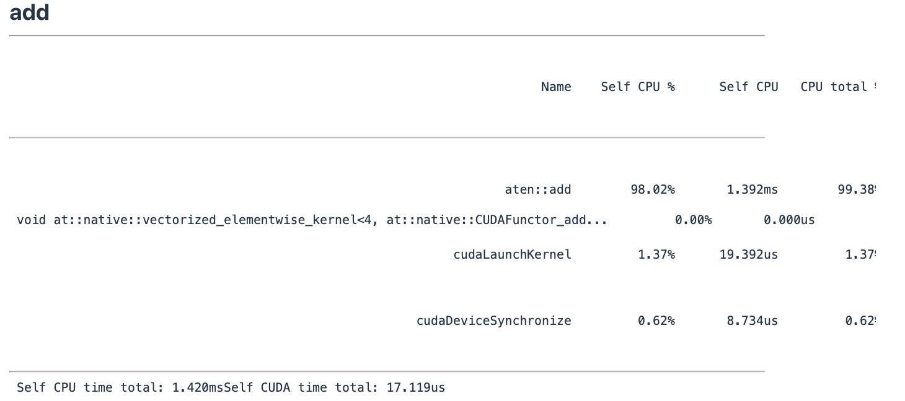

这里kernel里写了tile size和nums，此外这里有kernel launch和synchronization of CUDA devices 

kernel launch: CPU take the command and send it over to the GPU

cudaDeviceSynchronize waiting for GPU finish and send things back to CPU

Ms Millisecond, us MicroSecond, ns NanoSecond

#### aten 是PyTorch的C语言接口

ATen 是 PyTorch 的 **底层张量（Tensor）库**，它提供了张量操作的核心实现，比如加法、乘法、卷积等。

是 PyTorch C++ 核心的一部分，很多 Python 层面的 torch.add 或 + 操作，最终都会调用 ATen 实现。

### matmul

cuda spend more time

if large dimension, execute cutlass::Kernel

if small dimension, execute xmma

different dimension and hardware will dispatch to different matrix multiply primitives under the hood

so it has different performance characteristics

### cutlass

在 GPU 上高效实现矩阵乘法（GEMM）、卷积等线性代数运算，同时自动利用 **Tensor Core**

是 **模板库**，所以几乎所有参数（数据类型、tile 大小、线程分配策略、tensor core 硬件启用）都在编译期确定

不只是一个单纯的“GEMM kernel”，而是一套 **可组合的层次化 GPU kernel 构建框架**

#### 为什么高性能

* 层次化 tiling / memory hierarchy 优化

  GPU 的性能瓶颈通常是 **内存访问**，特别是 global memory。CUTLASS 对 GEMM 做了多层 tiling

  | **层级**                 | **作用**                                                     |
  | ------------------------ | ------------------------------------------------------------ |
  | Thread-level tile        | 每个线程计算小块结果，利用 register                          |
  | Warp-level tile          | 由 warp 内线程共享 load / store 数据，使用 warp shuffle      |
  | Block-level tile         | Block 内共享 memory (shared memory) 存放 tile，提高 global memory reuse |
  | Grid-level decomposition | 多 block 分配全矩阵任务，实现并行                            |

  > 普通 tiling GEMM 可能只考虑 **block-level tile** 或线程级 tile，没有精细设计多层 tile 和 warp shuffle

* Tensor Core / SIMT 优化

  CUTLASS 可以生成 **Tensor Core GEMM kernel**（使用 FP16/TF32/INT8），而不是普通的 CUDA core GEMM。

   它的 **warp-level tile + MMA (Matrix Multiply-Accumulate) instructions** 可以充分利用 Tensor Core 的矩阵乘法硬件，速度比普通 FP32 GEMM 高很多。

* Memory movement 和 overlap

  CUTLASS 使用 **double buffering**（寄存器和 shared memory 之间）

  - 一边计算当前 tile；
  - 一边 preload 下一个 tile 数据到 shared memory

  这样计算和内存访问可以 **完全重叠**，减少 idle

* 模板生成 / 编译期优化

  所有 tile 大小、loop unrolling、vectorization、memory alignment 都在 **编译期确定**，减少 runtime 分支和索引计算开销。

  CUDA kernel 里很少用 if/else，几乎都是 straight-line code → better ILP

### Observations

You can see what CUDA kernels are actually being called.

Different CUDA kernels are invoked depending on the tensor dimensions.

Name of CUDA kernel tells us something about the implementation.

Example: **cutlass_80_simt_sgemm_256x128_8x4_nn_align1**

cutlass: NVIDIA's CUDA library for linear algebra

256x128: **tile size**

### cdist

vector a and vector b, cdist is their Euclidean distance

```
aten::cdist
aten::_euclidean_dist
Torch command map in C interface to sort of lower level C disk
then we have bunch of primitive: aten::matmul, aten::mm 78%, aten::cat 6.7%, aten::pow 5.0%
matrix multiplies, concatenation拼接, taking the powers 取幂
```

可以优化matrix multiply

### gelu

gelu就是`x 被保留下来的概率 × x 本身`

$\text{GELU}(x) = x \cdot \Phi(x)$

linear structure plus non-linear structure in MLP

```
gelu_function = lambda a, b: torch.nn.functional.gelu(a + b)
gelu_profile = profile("gelu", run_operation2(dim=2048, operation=gelu_function))
```

### softmax

### mlp

profile it like using torch profiler, but not a good way!

### Nsight System

In cuda part, like CUDA HW, there is what GPU is doing

In Threads part, there is what CPU is doing

#### **NVTX（NVIDIA Tools Extension）** 

> **给 GPU / CPU 程序“打时间轴标签”的工具，用来让 profiler 看懂你的代码在干什么**

```python
# mark all the above range of code belong to defind_model part
with nvtx.range("defind_model"):
  mdoel = MLP(dim,num_layers).to(get_device())
	# will record step, add annotation before calling profiler
  nvtx.range_push(f"step_{step}")
  nvtx.range_pop()
```

first time call a piece of code in PyTorch, it doesn't directly execute, it will actually do things like on the fly compile things

like runtime trigger and module loading initialize the layer and the computation and move code into GPU

CPU 说正在doing layer 1时，实际上它queuing commands into the GPU，处理速度大于GPU，所以GPU开始处理layer1的时候，CPU已经处理到layer9

然后CPU会维持一个队列，一旦超前达到队列上限，就会暂停这种超前运行

还有一个注意点就是 print statement，比如`print(f"loss:{y.item():.6f")`，这个在CPU上执行，需要获取GPU计算出的那个值，所以几乎变成Synchronized了！

CPU不会成为bottleneck！

### CUDA

Grid: collection of thread blocks: numBlocks = (2, 4), blockDim = (1, 8)

Thread block: collection of threads: blockIdx = (0, 1)

Thread: single unit of operation: threadIdx = (0, 3).

write code for a thread, using 3 parameters: (blockIdx, blockDim, threadIdx) 

Set CUDA_LAUNCH_BLOCKING so that if there are errors, CUDA will tell you what went wrong.

```c
os.environ["CUDA_LAUNCH_BLOCKING"] = "1"
```

比如Gelu，最开始就是kernel，会被发送到GPU，GPU执行后返回内容，后面是wrapper

```c
__global__ void gelu_kernel(float* in, float *out){
  // Get the index into the tensor
  int i = blockIdx.x * blockDim.x + threadIdx.x;
  if (i < num_elements) { // To handle the case when n < numBlocks * blockDim
  	// Do the actual computation
  	out[i] = 0.5 * in[i] * (1.0 + tanh(0.79788456 * (in[i] + 0.044715 * in[i] * in[i] * in[i])));
  }
}
inline unsigned int cdiv(unsigned int a, unsigned int b) {
  // Compute ceil(a / b)
  return (a + b - 1) / b;
}

torch::Tensor gelu(torch::Tensor x) {
TORCH_CHECK(x.device().is_cuda());
TORCH_CHECK(x.is_contiguous());
// Allocate empty tensor
torch::Tensor y = torch::empty_like(x);
// Determine grid (elements divided into blocks)
int num_elements = x.numel();
int block_size = 1024; // Number of threads
int num_blocks = cdiv(num_elements, block_size);
// Launch the kernel
gelu_kernel<<<num_blocks, block_size>>>(x.data_ptr<float>(), y.data_ptr<float>(), num_elements);
C10_CUDA_KERNEL_LAUNCH_CHECK(); // Catch errors immediately
return y;
}
```

在wrapper函数里，首先检查X是不是在GPU上，其次是不是continuous连续的

```c
TORCH_CHECK(x.device().is_cuda());
TORCH_CHECK(x.is_contiguous());
```

> **If not continuous?**
>
> assert will report error,
>
> there is almost no reason for memory to be fragmented, cause it will allocate continously 
>
> Transpose or views shuffling will cause this problem, since the access to data is uncontinously, but wrapper can handle it??
>
> **Why manual slow**
>
> DRAM to SM communication cost 这个占主要 

然后创造empty tensor，计算总数，计算block_size，最后cdiv 计算block数量，ceil上取整，这个是bookkeeping预处理 

## Triton

will manage coalescing of memory, like in DRAM get 4 adjacent values at a time (burst mode)

* Memory coalescing (transfer from DRAM) 
* Shared memory management
* Scheduling within SMs
* Scheduling across SMs

```python
def triton_gelu(x: torch.Tensor):
    assert x.is_cuda
    assert x.is_contiguous()

    # Allocate output tensor
    y = torch.empty_like(x)

    # Determine grid (elements divided into blocks)
    num_elements = x.numel()
    block_size = 1024  # Number of threads
    num_blocks = triton.cdiv(num_elements, block_size)

    triton_gelu_kernel[(num_blocks,)](
        x, y, num_elements, BLOCK_SIZE=block_size
    )
    return y


@triton.jit
def triton_gelu_kernel(x_ptr, y_ptr, num_elements, BLOCK_SIZE: tl.constexpr):
    # Input is at `x_ptr` and output is at `y_ptr`
    # | Block 0 | Block 1 | ... |
    # BLOCK_SIZE num_elements

    pid = tl.program_id(axis=0)
    block_start = pid * BLOCK_SIZE

    # Indices where this program instance should operate
    offsets = block_start + tl.arange(0, BLOCK_SIZE)

    # Handle boundary
    mask = offsets < num_elements

    # Read
    x = tl.load(x_ptr + offsets, mask=mask)

    # Approx GELU:
    # 0.5 * x * (1 + tanh(sqrt(2/pi) * (x + 0.044715 * x^3)))
    # tanh(a) = (exp(2a) - 1) / (exp(2a) + 1)
    a = 0.79788456 * (x + 0.044715 * x * x * x)
    exp = tl.exp(2 * a)
    tanh = (exp - 1) / (exp + 1)
    y = 0.5 * x * (1 + tanh)

    # Store
    tl.store(y_ptr + offsets, y, mask=mask)
```

Load 4 values at a time

`@%p1 ld.global.v4.b32 { %r2, %r3, %r4, %r5 }, [ %rd1 + 0 ];`

Triton在py文件里，但是由于下面的

-  `@triton.jit`
- 用 `tl.load / tl.store / tl.arange`
- 像 NumPy / PyTorch 一样写

```
@triton.jit
def kernel(x_ptr, y_ptr, ...):
    x = tl.load(...)
```

这段代码：

- **不会由 Python 解释器逐行执行**
- 而是被 **Triton 编译器分析 AST**
- 然后 **JIT 编译成 GPU kernel**


### torch.compile

```python
compiled_gelu = torch.compile(manual_gelu)
```

It will automatic optimization, like kernel fusion

so model jit is pretty great, can do optimization

```python
def triton_softmax(x: torch.Tensor):
    # Allocate output tensor
    y = torch.empty_like(x)

    # Determine grid
    M, N = x.shape
    block_size = triton.next_power_of_2(N) # Each block contains all the columns
    num_blocks = M  # One block per row

    # Launch kernel
    triton_softmax_kernel[(M,)](
        x_ptr=x,
        y_ptr=y,
        x_row_stride=x.stride(0),
        y_row_stride=y.stride(0),
        num_cols=N,
        BLOCK_SIZE=block_size,
    )

    return y


@triton.jit
def triton_softmax_kernel(
    x_ptr,
    y_ptr,
    x_row_stride,
    y_row_stride,
    num_cols,
    BLOCK_SIZE: tl.constexpr,
):
    assert num_cols <= BLOCK_SIZE

    # Process each row independently
    row_idx = tl.program_id(0)
    col_offsets = tl.arange(0, BLOCK_SIZE)

    # Read from global memory
    x_start_ptr = x_ptr + row_idx * x_row_stride
    x_ptrs = x_start_ptr + col_offsets
    x_row = tl.load(
        x_ptrs,
        mask=col_offsets < num_cols,
        other=float("-inf"),
    )

    # Compute softmax
    x_row = x_row - tl.max(x_row, axis=0)
    numerator = tl.exp(x_row)
    denominator = tl.sum(numerator, axis=0)
    y_row = numerator / denominator

    # Write back to global memory
    y_start_ptr = y_ptr + row_idx * y_row_stride
    y_ptrs = y_start_ptr + col_offsets
    tl.store(y_ptrs, y_row, mask=col_offsets < num_cols)

```

triton is much like python code, it needs more load, store and some trace part.

# LMs

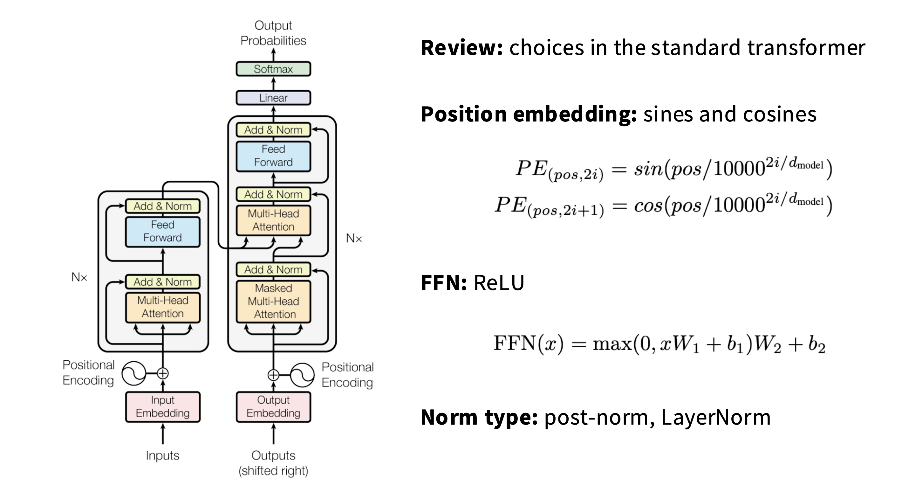

FF layers use SwiGLU, not ReLU

## Pre-vs-post norm

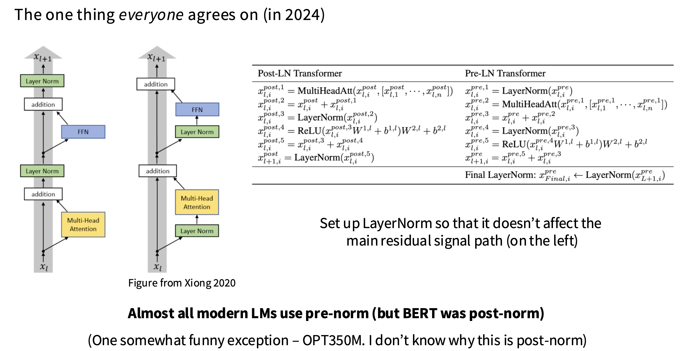

If putting LayerNorms in residual streams is bad.. Why not post-norm outside the stream?

## LayerNorm vs RMSNorm


## Perplexity

“困惑率”（**Perplexity, PPL**）是衡量语言模型预测能力的一个经典指标，尤其在 **概率语言模型和 LLM** 中用得非常广泛

假设模型给定一个序列 $x_1, x_2, \dots, x_N$，语言模型会计算条件概率：
$$
P(x_1, x_2, \dots, x_N) = \prod_{t=1}^{N} P(x_t \mid x_1, \dots, x_{t-1})
$$
**困惑率**定义为：
$$
\text{PPL} = \exp \left( - \frac{1}{N} \sum_{t=1}^{N} \log P(x_t \mid x_1, \dots, x_{t-1}) \right)
$$
或者等价地：
$$
\text{PPL} = 2^{H}, \quad H = \text{交叉熵}
$$
PPL 越小 → 模型越“自信” → 预测越准确

PPL 越大 → 模型越“困惑” → 预测不确定性高
