https://stanford-cs336.github.io/spring2025/

# Lec1

basics, systems, scaling laws, data, alignment

* Data processing: avoid wasting precious compute updating on bad / irrelevant data
* Tokenization: working with raw bytes is elegant, but compute-inefficient with today's model architectures.
* Model architecture: many changes motivated by reducing memory or FLOPs (e.g., sharing KV caches, sliding window attention)
* Training: we can get away with a single epoch
* Scaling laws: use less compute on smaller models to do hyperparameter tuning
* Alignment: if tune model more to desired use cases, require smaller base models

### Tokenization

convert between strings and sequences of integers (tokens)

#### **Byte-Pair Encoding (BPE) tokenizer**

#### Byte-based tokenization

 Unicode encoding is UTF-8 (compression rate 1, bad)

#### Word-based tokenization

#### Byte Pair Encoding (BPE)

https://zhuanlan.zhihu.com/p/448147465

Basic idea: train the tokenizer on raw text to automatically determine the vocabulary.

```python
# 创建一个分词器实例
tokenizer = BPETokenizer(params)

# 原始文本
string = "the quick brown fox"  # @inspect string

# 对文本进行编码，得到索引序列
indices = tokenizer.encode(string)  # @inspect indices

# 将索引序列解码回文本
reconstructed_string = tokenizer.decode(indices)  # @inspect reconstructed_string

# 验证解码后的字符串是否与原始字符串一致
assert string == reconstructed_string
```

### Variants:

Activation functions: ReLU, SwiGLU

Positional encodings: sinusoidal, RoPE

Normalization: LayerNorm, RMSNorm

Placement of normalization: pre-norm versus post-norm

MLP: dense, mixture of experts

Attention: full, sliding window, linear

Lower-dimensional attention: group-query attention (GQA), multi-head latent attention (MLA)

State-space models: Hyena

### Training

Optimizer (e.g., AdamW, Muon, SOAP)

Learning rate schedule (e.g., cosine, WSD) 

Batch size (e..g, critical batch size)

Regularization (e.g., dropout, weight decay)

Hyperparameters (number of heads, hidden dimension): grid search

### Inference

Includes **prefill and decode**

Prefill (similar to training): tokens are given, can process all at once (compute-bound)

Decode: need to generate one token at a time (memory-bound)

* Use cheaper model (via model pruning, quantization, distillation)

* Speculative decoding: use a cheaper "draft" model to generate multiple tokens, then use the full model to score in parallel (exact decoding!)

* Systems optimizations: KV caching, batching

### scaling laws

Goal: do experiments at small scale, predict hyperparameters/loss at large scale

given a FLOPs budget (C), use **bigger model (N) or train on more tokens**

D = 20N (like 1.4B parameter model should be trained on 28B tokens)

> 1. 提前预测最终模型效果，知道每次训练的大概能到什么程度，要是不及预期可以根据预算再进行调整
> 2. 在小尺寸模型上做置信的实验，进行数据、算法策略验证，降低实验的时间、资源成本
> 3. 在真正的大规模预训练中，随时监测模型效果是否符合预期

### Evaluation

### Data curation

### Data processing

### Supervised finetuning (SFT)

Supervised learning: fine-tune model to maximize p(response | prompt)

# Lec 2

* **primitives needed to train a model**
* **go bottom-up from tensors to models to optimizers to the training loop.**
* **pay close attention to efficiency**

### training

```python
note_about_randomness()  
data_loading()

optimizer()
train_loop()
checkpointing()
mixed_precision_training()
```

##### `note_about_randomness()`

记录或控制随机性，保证训练的 可重复性（Reproducibility）

```python
import torch
import random
import numpy as np

def note_about_randomness():
    torch.manual_seed(42)
    random.seed(42)
    np.random.seed(42)
```

##### `data_loading()`

`torch.utils.data.DataLoader`

* 加上 `num_workers` 参数，开启多线程加载
* **预处理 pipeline：**
  - 数据增强（augmentation）
  - tokenization / normalization
  - batch 拼接
  - pin_memory 加速 GPU 内存传输

##### `optimizer()`

* 定义优化器（如 SGD, Adam），负责根据 loss 更新模型参数
* `optimizer = torch.optim.Adam(model.parameters(), lr=1e-3)`

##### `train_loop()`

```python
for batch in dataloader:
    outputs = model(batch)
    loss = loss_fn(outputs, labels)
    loss.backward()
    optimizer.step()
    optimizer.zero_grad()
```

这里`loss.backward()`：只是把梯度算出来，暂时存储在每个参数的 `.grad` 属性里。

`optimizer.step()`：读取 `.grad`，做优化算法的参数更新。

如果不清零，第二次 `.backward()` 会把梯度叠加到第一次的基础上，导致错误。``optimizer.zero_grad()`清空参数的 `.grad` 属性

* 分布式训练（如 DDP）时，需在这里调用同步/异步通信

##### `checkpointing()`

保存训练的中间状态

- 模型参数
- 优化器状态
- 学习率调度器状态
- 当前 epoch/step

```python
torch.save({'model': model.state_dict(),
            'optimizer': optimizer.state_dict()}, 'checkpoint.pth')
```

##### `mixed_precision_training()`

```python
from torch.cuda.amp import GradScaler, autocast

scaler = GradScaler()
with autocast():
    outputs = model(batch)
    loss = loss_fn(outputs, labels)

scaler.scale(loss).backward()
scaler.step(optimizer)
scaler.update()
```

### **FLOPs**

70B 15T token

```python
#total_flops = 6 * N_params * N_tokens
total_flops = 6*70e9*15e12
```

1 次 **前向传播**（forward pass）大概 ≈ 2 × 参数数量

1 次 **反向传播**（backward pass）大概 ≈ 4 × 参数数量

这里4就是需要计算两次矩阵乘法

一个计算梯度权重，一个计算梯度的输入

```python
bytes_per_parameter = 4 + 4 + (4 + 4) # parameters, gradients, optimizer state
```

use float32 for parameters and gradients, also use bf16 for parameters and gradients (2 + 2) and keep an extra float32 copy of the parameters (4). This doesn't save memory, but is faster.

activations are not accounted for

H100s support two variants of FP8: E4M3 (range [-448, 448]) and E5M2  ([-57344, 57344])

## tensor

### `tensors_basics()`

Tensors are the basic building block for storing everything: parameters, gradients, optimizer state, data, activations.

```python
x=torch.tensor([[1.,2,3],[4,5,6]])
x=torch.zeros(4,8)
x=torch.ones(4,8)
x=torch.randn(4,8)

x=torch.empty(4,8)
#set the value later
nn.init.trunc_normal_(x,mean=0,std=1,a=-2,b=2) #截断正态分布初始化函数，a截断下界，b截断上界
```

### `tensors_memory()`

**Float32**, fp32 is the default.  (4bytes)

1 sign + 8 exponent + 23 fractions

**Float16** (2bytes)

fp16 5exp

1 sign + 5 exponent + 10 fractions

```
x = torch.tensor([1e-8], dtype=torch.float16)  # @inspect x
assert x == 0  # Underflow!
```

表示非常小的数时的限制，即**数值下溢（underflow）**问题。

**bfloat16**

1 sign + 8 exponent + 7 fractions

没有underflow了

bf16 8exp

**Fp8**

### `tensors_on_gpus()`

tensor stores in CPU memory and need to move to GPU memory

```python
x.device == torch.device("cpu")
torch.cuda.is_available()
num_gpus=torch.cuda.device_count()
for i in range(num_gpus):
    properties = torch.cuda.get_device_properties(i)
    
memory_allocated = torch.cuda.memory_allocated()
y = x.to("cuda:0")
y.device = torch.device("cuda",0)
```

### `tensor_operations()`

#### `tensor_storage()`

```python
x.stride(dim)
# 在 PyTorch 中，x.stride(dim) 表示：在维度 dim 上移动一步（索引 +1）时，在底层内存中要跳过多少个元素。
```

#### `tensor_slicing()`

Many operations simply provide a different view of the tensor.

This does not make a copy, and therefore mutations in one tensor affects the other.

```python
x = torch.tensor([[1., 2, 3], [4, 5, 6]])

y = x[0] # row 0
assert torch.equal(y, torch.tensor([1., 2, 3]))
assert same_storage(x, y)

y = x[:,1] #column 1
assert torch.equal(y, torch.tensor([2, 5]))
assert same_storage(x, y)

y = x.view(3, 2) # @inspect y
assert torch.equal(y, torch.tensor([[1, 2], [3, 4], [5, 6]]))
assert same_storage(x, y)

y = x.transpose(1, 0) # @inspect y
y.view(2,3)
assert torch.equal(y, torch.tensor([[1, 4], [2, 5], [3, 6]]))
assert same_storage(x, y)

# One can enforce a tensor to be contiguous first
y = x.transpose(1, 0).contiguous().view(2, 3) # @inspect y
assert not same_storage(x, y)
```

#### `tensor_elementwise()`

```python
# triu takes the upper triangular part of a matrix.
x = torch.ones(3, 3).triu()
# causal attention mask
```

#### `tensor_matmul()`

#### `tensor_einops()`

Einops is a library for manipulating tensors

```python
z = einsum(x, y, "batch seq1 hidden, batch seq2 hidden -> batch seq1 seq2")
# Or can use ... to represent broadcasting over any number of dimensions
z = einsum(x, y, "... seq1 hidden, ... seq2 hidden -> ... seq1 seq2") 

x: Float[torch.Tensor, "batch seq hidden"] = torch.ones(2, 3, 4)
y = x.mean(dim=-1)
y = reduce(x, "... hidden -> ...", "sum")

# rearrange
x: Float[torch.Tensor, "batch seq total_hidden"] = torch.ones(2, 3, 8)
# ...where total_hidden is a flattened representation of heads * hidden1
w: Float[torch.Tensor, "hidden1 hidden2"] = torch.ones(4, 4)
# Break up total_hidden into two dimensions (heads and hidden1)
x = rearrange(x, "... (heads hidden1) -> ... heads hidden1", heads=2) 
# Perform the transformation by w:
x = einsum(x, w, "... hidden1, hidden1 hidden2 -> ... hidden2") # @inspect x
# Combine heads and hidden2 back together:
x = rearrange(x, "... heads hidden2 -> ... (heads hidden2)") # @inspect x
```

**A100 has a peak performance of 312 teraFLOP/s**

```
assert a100_flop_per_sec == 312e12
```

**H100 has a peak performance of 1979 teraFLOP/s with sparsity, 50% without**

```
assert h100_flop_per_sec == 1979e12 / 2
```

### **Model FLOPs utilization (MFU)**

Definition: (actual FLOP/s) / (promised FLOP/s) [ignore communication/overhead]

mfu = actual_flop_per_sec / promised_flop_per_sec # @inspect mfu

**Usually, MFU of >= 0.5 is quite good (and will be higher if matmuls dominate)**

**comparing bfloat16 to float32, the actual FLOP/s is higher**

Putting it togther:

Forward pass: 2 (# data points) (# parameters) FLOPs

Backward pass: 4 (# data points) (# parameters) FLOPs

Total: 6 (# data points) (# parameters) FLOPs

### data_loading

`orig_data.tofile("data.npy")`

Use memmap to lazily load only the accessed parts into memory.

`data = np.memmap("data.npy", dtype=np.int32)`

By default, CPU tensors are in paged memory. We can explicitly pin

x = x.pin_memory()

**This allows us to copy** x **from CPU into GPU asynchronously.**

`x = x.to(device, non_blocking=True)`

This allows us to do two things in parallel (not done here):

Fetch the next batch of data into CPU

Process x on the GPU.

**Let's define the AdaGrad optimizer**

* momentum = SGD + exponential averaging of grad

* AdaGrad = SGD + averaging by grad^2

* RMSProp = AdaGrad + exponentially averaging of grad^2

* Adam = RMSProp + momentum

# Lec 3

### Pre-vs-post norm

just use Pre norm!!!

post norm will be unstable and have to do some careful lr warm-up style things

Grok and gamma 2 add layer norm after FFN


> why layer norm in the residual path bad?
>
> the residual gives you the identity connection from top to bottom, this makes gradient propagation very easy. Put layer in the residual might mess that kind of gradient behavior

### LayerNorm vs RMSNorm

nearly all the model use RMSNorm

Modern explanation – it’s faster (and just as good).

• Fewer operations (no mean calculation)

• Fewer parameters (no bias term to store)


important to think about the memory, not just about FLOPS


### dropping bias terms

Most modern transformers don’t have bias terms.

$FFN(x)=\sigma(xW_1)W_2$

Reasons: memory (similar to RMSnorm) and optimization stability

### recap

Basically everyone does pre-norm.

* Intuition – keep the good parts of residual connections

* Observations – nicer gradient propagation, fewer spike

* Some people add a second norm outside the residual stream (NOT post-norm)

Most people do RMSnorm

* In practice, works as well as LayerNorm

* But, has fewer parameters to move around, which saves on wallclock time

* People more generally drop bias terms since the compute/param tradeoffs are not great.

### Activations

Llama, PaLM,T5 v1.1, most models post 2023 use SwiGLU/GeGLU

SwiGLU (swish is 𝑥 ∗ sigmoid(𝑥))

> Note: Gated models use smaller dimensions for the 𝑑𝑓𝑓 by 2/3???

可以把 **gating activation（门控制激活）** 理解成：

> **网络在每个位置用一个门（gate）来决定：信息要放大、通过、还是被压下去。**

它不是只做“激活”，而是在激活 *前后* 加上一个可学习的“门”，让模型动态控制流经的信号量。

下面用你能最快抓住直觉的方式解释。

y = gate(x) ⊙ activation(x)

门（gate）一般是：

- sigmoid
- swish
- GLU gate: linear(x1) + sigmoid(x2)
- 或者更复杂如 SwiGLU, GeGLU, ReGLU  

### consensus hyperparameter 1

There are two dimensions that are relevant – the feedforward dim (𝑑𝑓𝑓) and model dim (𝑑𝑚𝑜𝑑𝑒𝑙 ). What should their relationship be?

$d_{ff} = 4d_{model}$

This is almost always true. There’s just a few exceptions.

Remember that GLU variants scale down by 2/3rd. This means most GLU variants have 𝑑𝑓𝑓 =8/3𝑑𝑚𝑜𝑑𝑒𝑙 .

The ‘default’ choices of 𝑑𝑓𝑓 = 4𝑑𝑚𝑜𝑑𝑒𝑙 and GeLU 𝑑𝑓𝑓 = 2.66𝑑𝑚𝑜𝑑𝑒𝑙 have worked well for nearly all modern LLMs.

### Aspect ratios

𝒅𝒎𝒐𝒅𝒆𝒍/𝒏𝒍𝒂𝒚𝒆𝒓

Extremely deep models are harder to parallelize and have higher latency

### vocabulary sizes

Monolingual models – 30-50k vocab

Multilingual / production systems 100-250k

### Dropout and other regularization

pretraining dont need regularization?

pretraining usually need one epoch

There is a lot of data (trillions of tokens), more than parameters., SGD only does a single pass on a corpus (hard to memorize)

drop out 用的少了，一般用weight decay? Intuition violation!

> #### weight decay
>
> 传统梯度下降更新是：
> $$
> w \leftarrow w - \eta \cdot \nabla L(w)
> $$
> 加入 weight decay（L2 正则）后：
> $$
> w \leftarrow w - \eta \cdot (\nabla L(w) + \lambda w)
> $$
> 也就是多加了一个项：
> $$
> \lambda w
> $$
> 这就等价于每次都把权重往 0 拉一点。
>
> 因为“大的参数”容易导致模型更复杂、更加拟合训练数据。 Weight Decay 让模型更平滑、更简单，从而提高泛化能力。可以防止过拟合

Many older models used dropout during pretraining

Newer models (except Qwen) rely only on weight decay

#### Why weight decay LLMs

优化损失函数提升性能

It’s not to control overfitting

为什么不用drop out了呢？是因为单epoch情况下没有必要

### Stability tricks

Softmaxes – can be ill-behaved due to exponentials / divison by zero

原本的softmax 就是Z(x) = $\Sigma e^{x_i}$

然后z loss 就是在loss function上

它是一个额外加到 loss 上的小项，形式如下：减去
$$
L_{z} = \alpha \cdot \left( \sum_i z_i^2 \right)
$$

#### Softmax

假设模型输出 logits $\mathbf{z} = [z_1, z_2, \dots, z_V]$（Vocab size 为 $V$）：
$$
\text{softmax}(z_i) = \frac{e^{z_i}}{\sum_{j=1}^V e^{z_j}}
$$
通常训练的目标是 **交叉熵 loss**：
$$
L_{\text{CE}} = - \log \frac{e^{z_{y}}}{\sum_j e^{z_j}} = -z_y + \log \sum_j e^{z_j}
$$

#### z loss

$$
L_z = \alpha \, s^2 = \alpha \, (\log \sum_i e^{z_i})^2
$$

训练总 loss：
$$
L = L_{\text{CE}} + L_z = -z_y + \log \sum_j e^{z_j} + \alpha (\log \sum_j e^{z_j})^2
$$
优化成功的话，logZ(x)恒等于0

### QK norm

The query and keys are Layer (RMS) normed before going into the softmax operation.


inference 也会保留

### Attention heads

GQA / MQA : Saving inference costs by reducing the number of heads

#### Multi-Query Attention (MQA) 

have multiple queries, but just one dimension for keys and values

#### Does MQA hurt? 

Small PPL hit w/ MQA [Shazeer 2019] 

#### GQA

Don’t go all the way to one dimension of KV – have fewer dims

Simple knob to control expressiveness (key-query ratio) and inference efficiency


### Sparse window attention

Attending to the entire context can be expensive (quadratic).

Build sparse / structured attention that trades off expressiveness vs runtime (GPT3)

### sliding window attention

Just use the main part of the strided pattern – let depth extend effective context (Mistral)

简单说sparse更灵活

**局部 + 全局**（Longformer/BigBird）

- 局部是固定窗口
- 全局 token 可以 attend 所有位置

**随机稀疏**（Reformer、一些 block-sparse Transformer）

- 每个 token 的注意力位置部分随机选取
- 用于长序列时降低复杂度

### Current standard trick – interleave ‘full’ and ‘LR’ attention

From Cohere Command A – Every 4th layer is a full attention

- 大部分层（3/4）使用 **滑动窗口注意力**（高效，计算量小）
- 每隔 3 层，第 4 层使用 **全注意力**（捕捉全局信息）

Long-range info via NoPE, short-range info via RoPE + SWA.

# Lec 4

### Routing function


Token chooses experts 相当于就是一个word vector，乘一个W matrix，然后Sigmoid可以得到score了，这一一般K=2，


#### Shared Experts DeepSeekMOE


分成粒度更小的Experts，还有shared Experts

### Expert sizes

Fine-grained ratio 就是和正常size对比的比例，比如 1/14，routed 就是总共的experts的个数，activate就是真正使用的个数，shared就是都使用，不参与路由的个数

### How do we train MoEs

Major challenge: we need sparsity for training-time efficiency…

But sparse gating decisions are not differentiable!

简单说就是希望高效训练只激活部分experts，但是有效学习需要所有参数都能得到梯度更新

```
# 理想中的稀疏路由（不可微分）
expert_weights = router(input_tensor)  # 例如：[0.1, 0.8, 0.05, 0.05]
selected_expert = argmax(expert_weights)  # 选择 index=1
output = experts[selected_expert](input_tensor)  # 只使用专家1
```

这里的 `argmax()` 或 `top-k` 操作是**不可微分**的！

不可微分是因为router是discrete的

#### Solutions?

1. Reinforcment learning to optimize gating policies
2. Stochastic perturbations
3. Heuristic ‘balancing’ losses. **DeepSeek**

这里RL就是

- 将路由选择视为**决策问题**
- 使用策略梯度方法优化路由决策
- RL is the ‘right solution’ but gradient variances and complexity means it’s not widely used

Stochastic 通过注入可微分的噪声，使离散选择近似可微

Heruistic添加额外的损失函数来间接引导路由决策，负载均衡损失（Load Balancing Loss）

systems efficiency requires that we use experts evenly

如果忽略别的constrains，存在一个问题是tokens router to one experts and end up in local minimum，也就是一个experts很好，别的experts啥都不会

所以loss balancing可以避免这种local minimum


这里loss就是遍历整个experts，fi就是每个token分配到expert i的概率，是一个probability vector

Pi是路由到expert i 的概率，Pi路由，fi就是Top-K做出的实际路由

也就是获得越多的token，gradient下推的越厉害


不仅对于expert还有不同的device进行shard

#### DeepSeek v3 variation – per-expert biases


这里si,t是softmax的输出，bi就是一个fudge factor score for each expert

如果获取tokens不够多，就是增加bi来获得更多token

训练学习bi，如果太少tokens就bi加上gamma，太多就减去gamma，experts变得不attractive

### upcycling

把dense MLP当成MOE

DeepSeek MoE v2 vs v1

New things: Top-M device routing

V1 每个token → Router → 选择top-k个专家 → 激活这些专家

- 专家可能分布在不同的设备（GPU）上
- **跨设备通信**：token需要在设备间传输，产生昂贵的通信开销

**V2的核心创新**：**先在设备级别做路由，再在设备内部做专家路由**

```
传统MoE V1：
token → Router → 选择专家(可能跨设备) → 跨设备通信 → 计算

MoE V2 Top-M Device Routing：
token → Device Router → 选择top-M个设备 → 
    └→ 在每个选中设备内：Expert Router → 选择专家 → 计算
```

V3：**Sigmoid+Softmax topK + topM**

softmax强制所有专家的概率和为1，这假设每个token**必须**使用专家，但有些token可能不需要任何专家！

1. **稀疏性控制更灵活**：sigmoid允许某些专家得分为0
2. **两阶段筛选**：先宽选(top-M)，再精选(top-K)，减少错误选择
3. **自适应专家数量**：可以根据token复杂度动态选择专家数量

### MLA

Basic idea: express the Q, K, V as functions of a lower-dim, ‘latent’ activation

Benefits: when KV-caching, we only need to store 𝑐𝑡

𝐾𝑉, which can be much smaller.

𝑊𝑈𝐾 can be merged into the Q projection

(they also compress queries, for memory savings during training)

Complexity: rope conflicts with MLA-style caching

### MTP

Have small, lightweight models that predict multiple steps ahead

# Lec 5


Part 1: GPUs in depth – how they work and important parts

Part 2: Understanding GPU performance

Part 3: Putting it together – unpacking FlashAttention

### scale law

Parallel scale

CPU large control branch prediction, GPU have little control logic orchestrating

CPUs optimize for latency (each thread finishes quickly)

GPUs optimize for throughput (total processed data)

GPUs have many SM (streaming multiprocessors) that independently execute ‘blocks’ (jobs).

Each SM further contains many SPs (streaming processor) that can execute ‘threads’ in parallel

L1 and shared memory inside of SM, so it's quite fast

### Side thread TPU

TPU是Tensor Processing Unit，是专门加速机器学习的，有专门的MXU(matrix multiplication), VPU(data load in MXU, activation), 

### roofline model

### make GPUs go fast

1. Control divergence (not a memory bottleneck..)

2. Low precision computation

3. Operator fusion

4. Recomputation

   也就是一个读中间计算值，一个就从头重新计算，通过cpu compute换memory bound，trade off

   

5. Coalescing memory

6. Tiling

   tile size T, each input is read N/T times from global memory, factor of T reduction in global memory access.

### Complexities with tiling

Tile sizes may not divide the matrix size and lead to low utilization

like 256*256, tile 128 has 4 tiles, then 257\*256 tile 128 has 6 tiles

### Complexities with tiling 2 – memory alignment


如果多了一个就double load了，可以padding

### tiling

Tiling has a major impact through alignment.

### wave quantization

periodic behavior 1792 to 1793

Using a tile size of 256 × 128, there are 1792/256=7, 1792/128=14, 128= 7 × 14 = 98 tiles

1793, 1793/256=8, 1793/128=15, 8*15=120 tiles

An A100 has 108 SMs, so it cannot execute all 120

so it will execute 108 sms first then rest of then 

### making ML workloads go fast

Reduce memory accesses

* Coalescing
* Fusion

Move memory to shared memory

* Tiling

Trade memory for compute/accuracy

* Quantization

* Recomputation

### Flash Attention

> **FlashAttention = IO-aware tiled attention + fused kernel + online (incremental) softmax**

它解决的不是算力问题，而是 **HBM 带宽瓶颈**。


```text
HBM (global memory)   ← 慢 / 大
L2 cache
Shared memory (SRAM) ← 快 / 小
Registers             ← 更快
```

HBM 每个tile从HBM读一次，QKV最初存放位置，SRAM tile里的QKV，tile里的partial softmax state，tile里output accumulation

fusion是不把中间结果（QK、softmax score）写回 HBM，所有中间步骤都在一个 kernel 里，在 SRAM / registers 完成

Kernel Fusion+tiling(tiling for KQV matrix multiply, incremental softmax)


# Lec 6

A100 108 SMs

* DRAM [A100: 80GB] - big, slow

* L2 cache [A100: 40MB]

* L1 cache [A100: 192KB per SM] - small, fast

Thread, Thread block, Grid

> Why thread blocks? Shared memory.
>
> Intuition: group f(i)'s that read similar data together
>
> Threads within a thread block have shared memory (as fast as L1 cache) [A100: 164KB]
>
> Can synchronize threads (for reading/writing) within a block (but not across blocks)

32 Threads into one wave, and the problem: last wave has fewer thread blocks, leaving some SMs idle (low occupancy).

Wave quantization: make number of thread blocks divide # SMs.

Rule of thumb: number of thread blocks should be >= 4x # SMs 经验法则，线程总数应该大于等于 4倍SMs

### **Arithmetic intensity: # FLOPs / # bytes**

* If high, operation is compute-bound (good)

* If low, operation is memory-bound (bad)

General rule: matrix multiplication is compute-bound, everything else is memory-bound

计算性能拓展速度远大于内存性能扩展速度 scaling

most of the cases, the computations are going to end up being memory bound. 也就受限于内存限制

因为Matrix multiply是compute bound的，如果经过优化转为memory bound因此目标减少memory bound或者它的影响

### IMPORTANT: benchmark/profile your code!

#### benchmark()

```python
def benchmark(
    description: str,
    run: Callable,
    num_warmups: int = 1,
    num_trials: int = 3,
):
    """
    Benchmark `run` by executing it multiple times and returning the mean latency (ms).
    """

    # Warm-up: first runs might be slower due to compilation, cache cold start, etc.
    # We care about steady-state performance.
    for _ in range(num_warmups):
        run()

    if torch.cuda.is_available():
        torch.cuda.synchronize()

    # Time it for real now
    times: list[float] = []

    for _ in range(num_trials):  # Run multiple times to capture variance
        start_time = time.time()

        run()  # Actually perform computation

        if torch.cuda.is_available():
            torch.cuda.synchronize()  # Important: wait for CUDA kernels to finish

        end_time = time.time()
        times.append((end_time - start_time) * 1000)  # ms

    mean_time = mean(times)
    return mean_time
```

两个需要关注的点

* 这里warm up的作用就是第一次是JIT即时编译，没有cache，所以第一次是startup speed，这个作用 avoid measuring startup speed, instead, measure steady state speed
* CPU and GPU need synchronized by `torch.cuda.synchronize()`

####   


这里kernel里写了tile size和nums，此外这里有kernel launch和synchronization of CUDA devices 

kernel launch: CPU take the command and send it over to the GPU

cudaDeviceSynchronize waiting for GPU finish and send things back to CPU

Ms Millisecond, us MicroSecond, ns NanoSecond

#### aten 是PyTorch的C语言接口

ATen 是 PyTorch 的 **底层张量（Tensor）库**，它提供了张量操作的核心实现，比如加法、乘法、卷积等。

是 PyTorch C++ 核心的一部分，很多 Python 层面的 torch.add 或 + 操作，最终都会调用 ATen 实现。

### matmul

cuda spend more time

if large dimension, execute cutlass::Kernel

if small dimension, execute xmma

different dimension and hardware will dispatch to different matrix multiply primitives under the hood

so it has different performance characteristics

### cutlass

在 GPU 上高效实现矩阵乘法（GEMM）、卷积等线性代数运算，同时自动利用 **Tensor Core**

是 **模板库**，所以几乎所有参数（数据类型、tile 大小、线程分配策略、tensor core 硬件启用）都在编译期确定

不只是一个单纯的“GEMM kernel”，而是一套 **可组合的层次化 GPU kernel 构建框架**

#### 为什么高性能

* 层次化 tiling / memory hierarchy 优化

  GPU 的性能瓶颈通常是 **内存访问**，特别是 global memory。CUTLASS 对 GEMM 做了多层 tiling

  | **层级**                 | **作用**                                                     |
  | ------------------------ | ------------------------------------------------------------ |
  | Thread-level tile        | 每个线程计算小块结果，利用 register                          |
  | Warp-level tile          | 由 warp 内线程共享 load / store 数据，使用 warp shuffle      |
  | Block-level tile         | Block 内共享 memory (shared memory) 存放 tile，提高 global memory reuse |
  | Grid-level decomposition | 多 block 分配全矩阵任务，实现并行                            |

  > 普通 tiling GEMM 可能只考虑 **block-level tile** 或线程级 tile，没有精细设计多层 tile 和 warp shuffle

* Tensor Core / SIMT 优化

  CUTLASS 可以生成 **Tensor Core GEMM kernel**（使用 FP16/TF32/INT8），而不是普通的 CUDA core GEMM。

   它的 **warp-level tile + MMA (Matrix Multiply-Accumulate) instructions** 可以充分利用 Tensor Core 的矩阵乘法硬件，速度比普通 FP32 GEMM 高很多。

* Memory movement 和 overlap

  CUTLASS 使用 **double buffering**（寄存器和 shared memory 之间）

  - 一边计算当前 tile；
  - 一边 preload 下一个 tile 数据到 shared memory

  这样计算和内存访问可以 **完全重叠**，减少 idle

* 模板生成 / 编译期优化

  所有 tile 大小、loop unrolling、vectorization、memory alignment 都在 **编译期确定**，减少 runtime 分支和索引计算开销。

  CUDA kernel 里很少用 if/else，几乎都是 straight-line code → better ILP

### Observations

You can see what CUDA kernels are actually being called.

Different CUDA kernels are invoked depending on the tensor dimensions.

Name of CUDA kernel tells us something about the implementation.

Example: **cutlass_80_simt_sgemm_256x128_8x4_nn_align1**

cutlass: NVIDIA's CUDA library for linear algebra

256x128: **tile size**

### cdist

vector a and vector b, cdist is their Euclidean distance

```
aten::cdist
aten::_euclidean_dist
Torch command map in C interface to sort of lower level C disk
then we have bunch of primitive: aten::matmul, aten::mm 78%, aten::cat 6.7%, aten::pow 5.0%
matrix multiplies, concatenation拼接, taking the powers 取幂
```

可以优化matrix multiply

### gelu

gelu就是`x 被保留下来的概率 × x 本身`

$\text{GELU}(x) = x \cdot \Phi(x)$

linear structure plus non-linear structure in MLP

```
gelu_function = lambda a, b: torch.nn.functional.gelu(a + b)
gelu_profile = profile("gelu", run_operation2(dim=2048, operation=gelu_function))
```

### softmax

### mlp

profile it like using torch profiler, but not a good way!

### Nsight System

In cuda part, like CUDA HW, there is what GPU is doing

In Threads part, there is what CPU is doing

#### **NVTX（NVIDIA Tools Extension）** 

> **给 GPU / CPU 程序“打时间轴标签”的工具，用来让 profiler 看懂你的代码在干什么**

```python
# mark all the above range of code belong to defind_model part
with nvtx.range("defind_model"):
  mdoel = MLP(dim,num_layers).to(get_device())
	# will record step, add annotation before calling profiler
  nvtx.range_push(f"step_{step}")
  nvtx.range_pop()
```

first time call a piece of code in PyTorch, it doesn't directly execute, it will actually do things like on the fly compile things

like runtime trigger and module loading initialize the layer and the computation and move code into GPU

CPU 说正在doing layer 1时，实际上它queuing commands into the GPU，处理速度大于GPU，所以GPU开始处理layer1的时候，CPU已经处理到layer9

然后CPU会维持一个队列，一旦超前达到队列上限，就会暂停这种超前运行

还有一个注意点就是 print statement，比如`print(f"loss:{y.item():.6f")`，这个在CPU上执行，需要获取GPU计算出的那个值，所以几乎变成Synchronized了！

CPU不会成为bottleneck！

### CUDA

Grid: collection of thread blocks: numBlocks = (2, 4), blockDim = (1, 8)

Thread block: collection of threads: blockIdx = (0, 1)

Thread: single unit of operation: threadIdx = (0, 3).

write code for a thread, using 3 parameters: (blockIdx, blockDim, threadIdx) 

Set CUDA_LAUNCH_BLOCKING so that if there are errors, CUDA will tell you what went wrong.

```c
os.environ["CUDA_LAUNCH_BLOCKING"] = "1"
```

比如Gelu，最开始就是kernel，会被发送到GPU，GPU执行后返回内容，后面是wrapper

```c
__global__ void gelu_kernel(float* in, float *out){
  // Get the index into the tensor
  int i = blockIdx.x * blockDim.x + threadIdx.x;
  if (i < num_elements) { // To handle the case when n < numBlocks * blockDim
  	// Do the actual computation
  	out[i] = 0.5 * in[i] * (1.0 + tanh(0.79788456 * (in[i] + 0.044715 * in[i] * in[i] * in[i])));
  }
}
inline unsigned int cdiv(unsigned int a, unsigned int b) {
  // Compute ceil(a / b)
  return (a + b - 1) / b;
}

torch::Tensor gelu(torch::Tensor x) {
TORCH_CHECK(x.device().is_cuda());
TORCH_CHECK(x.is_contiguous());
// Allocate empty tensor
torch::Tensor y = torch::empty_like(x);
// Determine grid (elements divided into blocks)
int num_elements = x.numel();
int block_size = 1024; // Number of threads
int num_blocks = cdiv(num_elements, block_size);
// Launch the kernel
gelu_kernel<<<num_blocks, block_size>>>(x.data_ptr<float>(), y.data_ptr<float>(), num_elements);
C10_CUDA_KERNEL_LAUNCH_CHECK(); // Catch errors immediately
return y;
}
```

在wrapper函数里，首先检查X是不是在GPU上，其次是不是continuous连续的

```c
TORCH_CHECK(x.device().is_cuda());
TORCH_CHECK(x.is_contiguous());
```

> **If not continuous?**
>
> assert will report error,
>
> there is almost no reason for memory to be fragmented, cause it will allocate continously 
>
> Transpose or views shuffling will cause this problem, since the access to data is uncontinously, but wrapper can handle it??
>
> **Why manual slow**
>
> DRAM to SM communication cost 这个占主要 

然后创造empty tensor，计算总数，计算block_size，最后cdiv 计算block数量，ceil上取整，这个是bookkeeping预处理 

## Triton

will manage coalescing of memory, like in DRAM get 4 adjacent values at a time (burst mode)

* Memory coalescing (transfer from DRAM) 
* Shared memory management
* Scheduling within SMs
* Scheduling across SMs

```python
def triton_gelu(x: torch.Tensor):
    assert x.is_cuda
    assert x.is_contiguous()

    # Allocate output tensor
    y = torch.empty_like(x)

    # Determine grid (elements divided into blocks)
    num_elements = x.numel()
    block_size = 1024  # Number of threads
    num_blocks = triton.cdiv(num_elements, block_size)

    triton_gelu_kernel[(num_blocks,)](
        x, y, num_elements, BLOCK_SIZE=block_size
    )
    return y


@triton.jit
def triton_gelu_kernel(x_ptr, y_ptr, num_elements, BLOCK_SIZE: tl.constexpr):
    # Input is at `x_ptr` and output is at `y_ptr`
    # | Block 0 | Block 1 | ... |
    # BLOCK_SIZE num_elements

    pid = tl.program_id(axis=0)
    block_start = pid * BLOCK_SIZE

    # Indices where this program instance should operate
    offsets = block_start + tl.arange(0, BLOCK_SIZE)

    # Handle boundary
    mask = offsets < num_elements

    # Read
    x = tl.load(x_ptr + offsets, mask=mask)

    # Approx GELU:
    # 0.5 * x * (1 + tanh(sqrt(2/pi) * (x + 0.044715 * x^3)))
    # tanh(a) = (exp(2a) - 1) / (exp(2a) + 1)
    a = 0.79788456 * (x + 0.044715 * x * x * x)
    exp = tl.exp(2 * a)
    tanh = (exp - 1) / (exp + 1)
    y = 0.5 * x * (1 + tanh)

    # Store
    tl.store(y_ptr + offsets, y, mask=mask)
```

Load 4 values at a time

`@%p1 ld.global.v4.b32 { %r2, %r3, %r4, %r5 }, [ %rd1 + 0 ];`

Triton在py文件里，但是由于下面的

-  `@triton.jit`
- 用 `tl.load / tl.store / tl.arange`
- 像 NumPy / PyTorch 一样写

```
@triton.jit
def kernel(x_ptr, y_ptr, ...):
    x = tl.load(...)
```

这段代码：

- **不会由 Python 解释器逐行执行**
- 而是被 **Triton 编译器分析 AST**
- 然后 **JIT 编译成 GPU kernel**


### torch.compile

```python
compiled_gelu = torch.compile(manual_gelu)
```

It will automatic optimization, like kernel fusion

so model jit is pretty great, can do optimization

```python
def triton_softmax(x: torch.Tensor):
    # Allocate output tensor
    y = torch.empty_like(x)

    # Determine grid
    M, N = x.shape
    block_size = triton.next_power_of_2(N) # Each block contains all the columns
    num_blocks = M  # One block per row

    # Launch kernel
    triton_softmax_kernel[(M,)](
        x_ptr=x,
        y_ptr=y,
        x_row_stride=x.stride(0),
        y_row_stride=y.stride(0),
        num_cols=N,
        BLOCK_SIZE=block_size,
    )

    return y


@triton.jit
def triton_softmax_kernel(
    x_ptr,
    y_ptr,
    x_row_stride,
    y_row_stride,
    num_cols,
    BLOCK_SIZE: tl.constexpr,
):
    assert num_cols <= BLOCK_SIZE

    # Process each row independently
    row_idx = tl.program_id(0)
    col_offsets = tl.arange(0, BLOCK_SIZE)

    # Read from global memory
    x_start_ptr = x_ptr + row_idx * x_row_stride
    x_ptrs = x_start_ptr + col_offsets
    x_row = tl.load(
        x_ptrs,
        mask=col_offsets < num_cols,
        other=float("-inf"),
    )

    # Compute softmax
    x_row = x_row - tl.max(x_row, axis=0)
    numerator = tl.exp(x_row)
    denominator = tl.sum(numerator, axis=0)
    y_row = numerator / denominator

    # Write back to global memory
    y_start_ptr = y_ptr + row_idx * y_row_stride
    y_ptrs = y_start_ptr + col_offsets
    tl.store(y_ptrs, y_row, mask=col_offsets < num_cols)

```

triton is much like python code, it needs more load, store and some trace part.

# Lec 7

## Basics of networking for LLMs

#### Intra-node

```python
# 单机8卡服务器
import torch
import torch.distributed as dist

# 初始化进程组
dist.init_process_group(
    backend='nccl',  # NVIDIA Collective Communications Library
    init_method='tcp://localhost:23456',  # 本地通信
    world_size=8,     # 8个GPU都在同一节点
    rank=0           # 当前GPU的rank
)

# 节点内通信非常快，因为：
# 1. 通过PCIe或NVLink直接连接
# 2. 共享系统内存
# 3. 延迟极低

# 1. NVLink（最快）
# NVIDIA专用，GPU到GPU直连
# 带宽：900GB/s（NVLink 4.0）
# 延迟：~100纳秒

# 2. PCIe 5.0
# 通用标准
# 带宽：128GB/s（双向）
# 延迟：~500纳秒

# 3. 共享内存
# GPU间可以直接访问对方内存
# 零拷贝，最快的数据共享
```

#### Inter-node

```python
# 多机集群（比如4台服务器，每台8卡）
# 总共32个GPU

# 节点0上的代码
dist.init_process_group(
    backend='nccl',
    init_method='tcp://10.0.0.1:23456',  # 跨节点通信
    world_size=32,    # 32个GPU分布在4个节点
    rank=0           # 全局rank
)

# 节点间通信需要考虑：
# 1. 网络带宽限制
# 2. 网络延迟
# 3. 网络稳定性

# 1. InfiniBand（高性能计算）
# 带宽：400Gbps（HDR）
# 延迟：<1微秒
# RDMA支持：远程直接内存访问

# 2. 以太网（通用）
# 带宽：100Gbps
# 延迟：10-100微秒
# 成本低，部署简单

# 3. RoCE（RDMA over Converged Ethernet）
# 在以太网上实现RDMA
# 性价比高
```

由NCCL 英伟达集合通信库提供底层支持，下面例子都是假设有4个rank

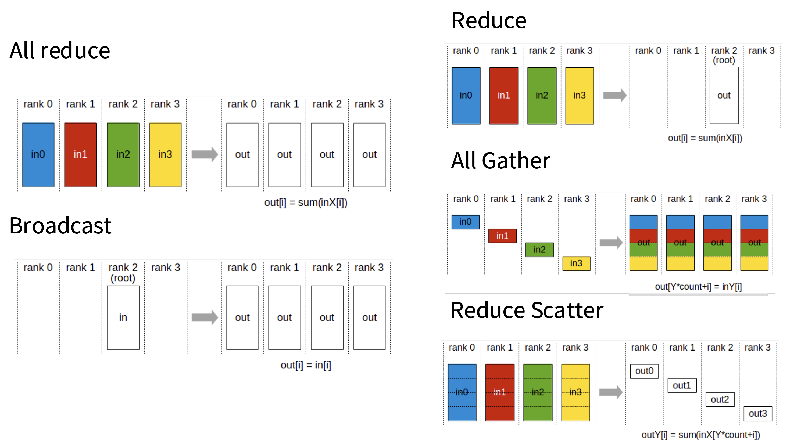

**通信数据量（Communication Volume）** 和 **算法步数（Latency Steps）**衡量集合通信的开销

#### All reduce

e.g. have 4 ranks, each have its own data, need to perform reduction operation, and copy the output to every single machine 

**All-Reduce = Reduce Scatter + All Gather**

先每个GPU拿自己的一部分，然后再Gather贡献拼出完整数据

#### Broadcast

Communication Volume is one time of the total number of outputs

#### Reduce

#### All Gather

每个 Rank 贡献一部分数据，最后所有 Rank 都拼出一份完整的数据。Rank 0 有 $A$，Rank 1 有 $B$... 结束后，大家手里都有 $[A, B, C, D]$

#### Reduce Scatter

DeepSpeed ZeRO优化器核心，每个GPU只存自己负责的那一块

All-Reduce 的中间步骤。它先做规约（相加），但**不把总和传给所有人**，而是把结果切开，每个 Rank 只拿一部分

## Different forms of parallel LLM training

### Data parallelism

#### Naïve data parallel

一次all reduce通信量是正在all reduce的数据量的两倍，正常来说就是 2P(N-1)/N

Communication overhead – transmits 2x # params every batch

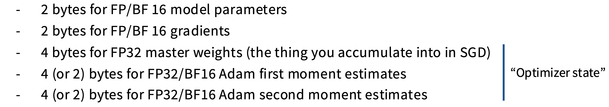

#### ZeRO levels 1-3

##### level 1 shard the optimizer states and all-reduce

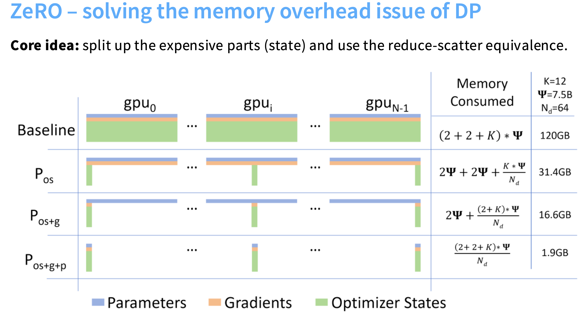

Each worker is responsible for updating a subset of params (corresponding to their slice) 

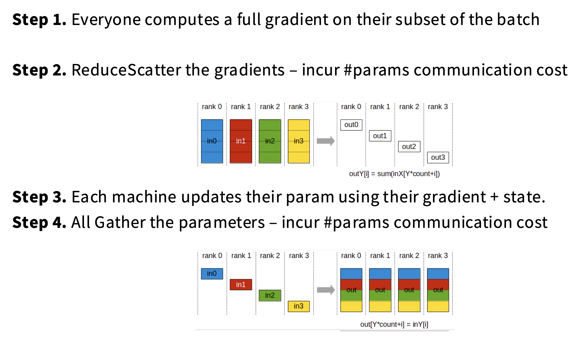


Memory

Naive DDP (4+K) * #params 

Zero (4+K/Ngpu) * #params

K is optimizer states

##### Level 2  shard the gradient

Complexity – we can never instantiate a full gradient vector, but each worker must compute a full gradient (since we’re data parallel)

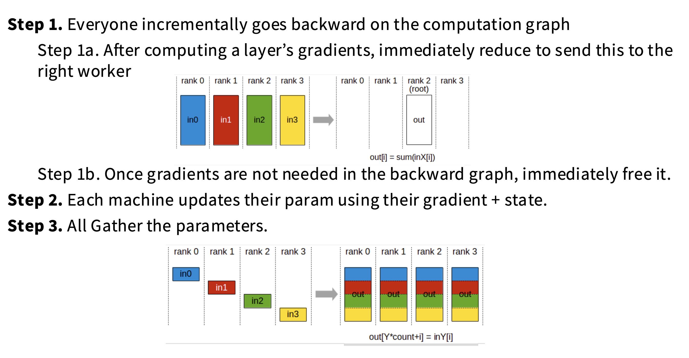

All Gather the parameters. 最后这里的All Gather就是让所有rank的model parameters进行更新

##### Level 3  shard everything

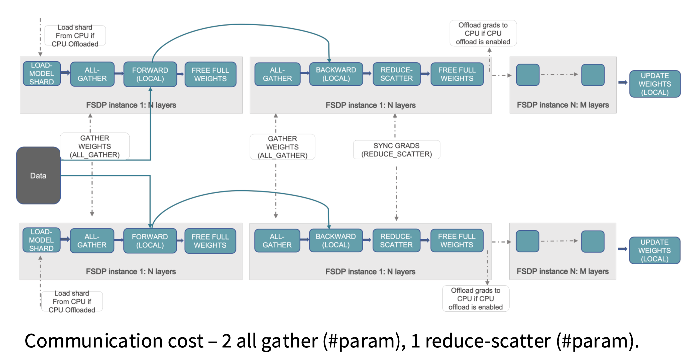

Activation 占内存，如果load a layer, do a forward, free it, the memory overhead is very low. And we can do the same thing with a backward pass. After apply all-gather the parameters I need, then do reduce scatter to update after the gradients computed. Then free the weights.

First All-Gather to get all parameters of this layers for the forward compute. After finished compute, free other weights.

Second All-Gather is to compute backward gradient, and last Reduce-Scatter is for 梯度聚合并分发到对应分片的 GPU，用于更新

FSDP has surprisingly low overhead!

* Zero stage 1 is 2*# param – it’s free! – you might as well always do it
* Zero stage 2 is 2*# param – it’s (almost) free (ignoring overhead)
* Zero stage 3 is 3*# param – 1.5x comm cost, but that’s not bad! (ignoring latency..)

Zero stage 3 is nice in principle, but can be slow and does not reduce activation memory

### Model parallelism

#### Pipeline parallel

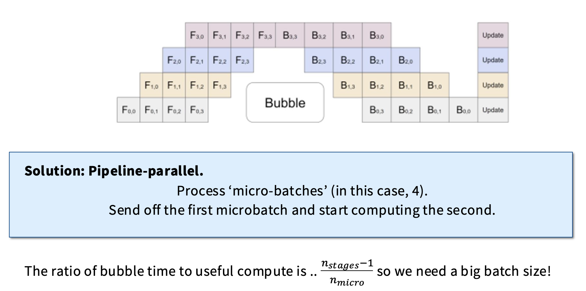

Batch sizes are key to hiding the bubble – otherwise pipeline rapidly degrades perf

‘Zero bubble’ pipelining

#### Tensor parallel

Assign columns (A1, A2) and rows (B1, B2) to separate GPUs.

In the forward pass, f is the identity, and g is an all-reduce.

In the backward pass, f is an all-reduce, g is the identity.

and f and g is like barrier


And always they used together, the pipeline parallel and tensor parallel.

The only example does pipeline parallel but not tensor is DeepSeek V3 

### Activation parallelism

Sequence parallel

## Scaling and training big LMs with parallelism

Total activation memory are 

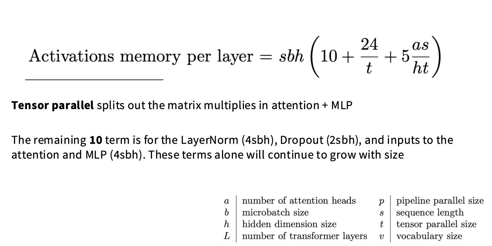

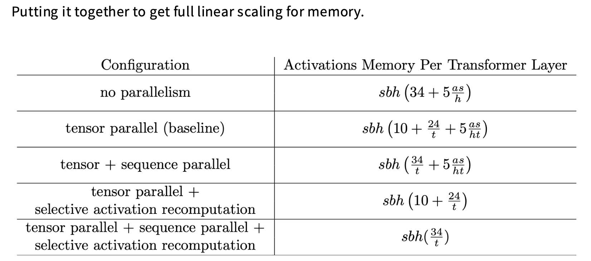

- 选择性激活重计算：**只重新计算注意力分数矩阵**，而不存储它，可以去掉5as/h

#### Rules

1. Until your model fits in memory.. (model+activation in memory)
   * Tensor parallel up to GPUs / machine
   * Pipeline parallel across machines
   * (Or use Zero-3, depending on **BW**)

2. Then until you run out of GPUs
   * Scale the rest of the way with data parallel (cause it is simple and works well on low bandwidth communication channels )

# Lec 8

(High Bandwidth memory) HBM larger, and each SM has L1 caches

**Generalized hierarchy (from small/fast to big/slow):**

* Single node, single GPU: L1 cache / shared memory

* Single node, single GPU: HBM

* Single node, multi-GPU: NVLink

* Multi-node, multi-GPU: NVSwitch

#### reduce聚合、gather收集、scatter分发

Reduce: performs some associative/commutative operation (sum, min, max)

Broadcast/scatter is inverse of gather

All: means destination is all devices

``````python
import torch.distributed as dist

setup(rank, world_size)

dist.barrier() 

tensor = torch.tensor([0., 1, 2, 3], device=get_device(rank)) + rank
dist.all_reduce(tensor=tensor, op=dist.ReduceOp.SUM, async_op=False)

dist.barrier()

dist.reduce_scatter_tensor(output=output, input=input, op=dist.ReduceOp.SUM, async_op=False)

dist.barrier()

dist.all_gather_into_tensor(output_tensor=output, input_tensor=input, async_op=False)

cleanup()
``````

此外benchmarking() 需要预先warm up

**`spawn`** 是一个用于启动并行进程/任务的函数

```python
# All-reduce
spawn(all_reduce, world_size=4, num_elements=100 * 1024**2)

# Reduce-scatter
spawn(reduce_scatter, world_size=4, num_elements=100 * 1024**2)

# 伪代码示例
def spawn(func, world_size=4, num_elements=...):
    processes = []
    for rank in range(world_size):
        # 为每个rank创建一个进程
        p = Process(target=func, args=(rank, world_size, num_elements))
        processes.append(p)
        p.start()
    
    for p in processes:
        p.join()  # 等待所有进程完成
```

计算bandwidth

```python
sent_bytes = tensor.element_size() * tensor.numel()
bandwidth = sent_bytes / total_duration
```

#### Sharding strategy: each rank gets a slice of the data

Losses are different across ranks (computed on local data)

Gradients are all-reduced to be the same across ranks

Therefore, parameters remain the same across ranks

```python
# the SGD
# then all reduce
for param in params:
  	dist.all_reduce(tensor=param.grad, op=dist.ReduceOp.AVG, async_op=False)
```

这里的all reduce可以理解为一个synchronize操作，如果有一个rank没到all reduce操作，就会hang挂起

#### tensor parallelism

split the layer instead of data

layers are linear + activation, each gpu compute their own part of data and activate

```python
# Forward pass
x = data
for i in range(num_layers):
    # Compute activations (batch_size x local_num_dim)
    x = x @ params[i]  # Note: this is only on a slice of the parameters
    x = F.gelu(x)
    
    # Allocate memory for activations (world_size x batch_size x local_num_dim)
    activations = [torch.empty(batch_size, local_num_dim, device=get_device(rank)) for _ in range(world_size)]
    
    # Send activations via all gather
    dist.all_gather(tensor_list=activations, tensor=x, async_op=False)
    
    # Concatenate them to get batch_size x num_dim
    x = torch.cat(activations, dim=1)
```

#### pipeline parallelism

Sharding strategy: each rank gets subset of layers, transfer all data/activations

Micro-batches 就是在batch_size基础上split，减少bubble

然后就是recv + send的过程，这里都是异步的

```python
dist.irecv(tensor=micro_batches[i], src=rank-1)

dist.isend(tensor=x, dst=rank+1)
```

#### set up

`dist.init_process_group("nccl", rank=rank, world_size=world_size)`

#### clean up

`torch.distributed.destroy_process_group()`

#### Computer Graph vs Cuda Graph

Computer Graph主要存储在CPU内存中，是框架的数据结构（Python对象）

Cuda Graph是CUDA运行时级别的概念，捕获和重放一系列CUDA操作（kernel启动、内存拷贝等）

**占用显存**，因为存储了：

1. **内核参数**：kernel launch配置
2. **指令缓存**：优化后的GPU指令序列
3. **依赖信息**：操作间的依赖关系
4. **内存池**：可能预分配的工作内存

# Lec 9

dataset size more large, the loss smaller

the compute more large, the loss smaller

the parameters more large, the loss smaller

### data scaling

x1 to xn uniform in 2D unit box, yi  = f(xi)+N(0,1)

task: estimate f(x)

cut up the 3D space into boxes with length $n^{-1/4}$

we have $\sqrt n$ boxes and each box gets $\sqrt n$ samples. so error around $\frac{1}{\sqrt n}$+(other smoothness terms)

in d-dimension, This means scaling is 𝒚 = − 1/d 𝒙 + 𝑪

Takeaway: flexible ‘nonparametric’ learning has dimension dependent scaling laws.

### Neural (LLM) scaling behaviors

how to build data? like input 5 parameters and not cancel each other, and add some noise on this point

sacling law proof that use **Switch Transformers and GLU**

#### Switch Transformer 

Sparse Mixture-of-Experts, MoE

传统 Transformer 层：每个 token 经过相同的 FFN，Switch Transformer 层：每个 token 只经过少数几个专家（通常1个）  

### model engineering

#### LSTM vs Transformers

#### Adam vs SGD

长宽比4-16之间的近似最优都说相近的

How should we allocate our limited resources?

• Train models longer vs train bigger models?

• Collect more data vs get more GPUs? 

### Batch Size & LR

Batch size – known to have strong diminishing returns past a certain point.

Critical batch = min number of examples for target loss / min number of steps for target loss

Critical batch the threshold between perfect scaling and inefficient scaling

**The smaller the loss target, The bigger the batch**

If we naively scale up – optimal learning rate depends on scale. We need scaling aware initialization and learning rate scaling

### MuP

当你 **改变模型宽度（hidden dim / heads / FFN）** 时：

- learning rate 要重新调
- init scale 要重新调
- loss scale 会变
- 梯度爆/消失风险变化

**超参不可迁移**，这在 **scaling law / 大模型工程** 中是灾难性的，每换一个宽度都要重新 sweep，compute 成本爆炸

muP 的做法是：**重新规定：哪些参数 scale 随宽度变，哪些不变** 让：

- activations scale 稳定
- gradients scale 稳定
- learning rate 不依赖宽度

cooling down, the learning rate is increase, and the batch size is increase as well 

### Noise Scale

> **Noise scale = SGD 梯度噪声的“有效温度”**

- 小 noise scale → 更新稳定、能压很低的 loss
- 大 noise scale → 抖动大、只能停在较高 loss

一句话版本：

> **Noise scale 决定了：你是在“精修”，还是在“带噪探索”**

The scaling law based design procedure.

* Train a few smaller models

* Establish a scaling law (e.g. ADAM vs SGD scaling law)

* Select optimal hyperparam based on the scaling law prediction.

### Joint data-model scaling laws describe how the two relate

### Cosine learning rate

**Cosine learning rate schedule 本质上是“平滑退火到 0”**

**不能随意中途截断（early stop / hard cut）**

**否则等价于“瞬间升高 noise scale”，破坏训练动力学**

它的设计目标不是“快降 LR”，而是：**在训练后期，连续、光滑地把系统“冷却”到 0 温度**

### Chinchilla

20 tokens per parameter

#parameters * 20 = #tokens

#tokens * #parameters = #FLOPS

#### Method 1 – minimum over runs.

Similar to the FLOPS figure on Kaplan the minimum over the union of all training curves is a power law.

FLOPS 和 parameters size成正比，FLOPS和Tokens成正比

#### Method 2 - IsoFLOPS

对于不同的Compute #FLOPS，可以根据曲线的到最优的#parameters 从而的到最低的Training Loss

#### Method 3 – Joint fits

### 为什么在给定 compute 下，模型参数数 P 和训练 token 数 D 会存在一个“最优配比”？？

**参数是“容量”，token 是“经验”**

模型聪明但没见过世面，或见过世面但不够聪明，都会浪费算力

- **参数太多 + token 太少** → 学不满、参数闲置、过拟合噪声
- **token 太多 + 参数太少** → 模型饱和、继续喂数据也学不会

在固定 FLOPs 下，一定存在一个平衡点。

Chinchilla aims to tell you what gives the best model for fixed training compute.. But most of the compute in a real deployment is inference.. So we should ‘over’ train

• GPT3 – 2 tokens / param

• Chinchilla – 20 tokens / param

• LLaMA65B – 22 tokens / param

• Llama 2 70B – 29 tokens / param

• Mistral 7B – 110 tokens / param

• Llama 3 70B – 215 tokens / param

# Lec 10

### Metrics

TTFT time-to-first-token: how long user waits before any generation happens

Latency (seconds/token): how fast tokens appear for a user

Throughput (tokens/second): useful for batch processing applications

Throughtput is for a batch, and high throughput doesn't means low latency!

### Efficiency

Training (supervised): can see all tokens, and can parallelize over sequence

Inference: generate sequentially, cannot parallelize

so it is harder for inference to utilize all compute resources

### Open-source package

vllm

tensorRT

TGI

### arithmetic_intensity

multiply X (B x D) and W (D x F) matrix

Step1: read X from HBM `2*B*D`

Step2: read W from HBM `2*D*F`

Step3: compute, multiply 1 flop, add 1 flop, flops +=` 2*B*F*D` 

Step4: write Y to HBM `2*B*F`

arithmetic intensity is the flops/data_transferred, **high is good**

```python
assert flops == 2*B*D*F
assert bytes_transferred == 2*B*D + 2*D*F + 2*B*F
intensity = (flops / bytes_transferred).simplify() # @inspect intensity
```

每从内存中搬运一个字节的数据，能进行多少次计算

- **计算密集型任务**（如矩阵乘法、深度学习训练）的算术强度**高**。
- **访存密集型任务**（如向量加法、稀疏矩阵操作）的算术强度**低**。

H100

```python
flops_per_second = 989e12
memory_bandwidth = 3.35e12
accelerator_intensity = flops_per_second / memory_bandwidth # @inspect accelerator_intensity
assert round(accelerator_intensity) == 295
```

If computation intensity > accelerator intensity, compute-limited (good)

If computation intensity < accelerator intensity, memory-limited (bad)

如果一个字节需要计算量超过accelerator intensity上限，就说明达到compute limit

S is the number of tokens we're conditioning on, T is the number of tokens we're generating.

specialize to prefill (T = S) and generation (T = 1).

### MLP layers

Read Wup (D x F), Wgate (D x F), Wdown (F x D) from HBM `3*2*D*F`

compute flops: `6*B*T*D`

`bytes_transferred == 4*B*T*D + 4*B*T*F + 6*D*F`

`intensity == B*T`

Prefill: easy to make compute-limited (good) by making B T large enough

Generation: Generating one token at a time (T = 1), B is number of concurrent requests, hard to make large enough!

### Attention layers

Read Q (B x T x D), K (B x S x D), V (B x S x D) from HBM

`bytes_transferred += 2*B*T*D + 2*B*S*D + 2*B*S*D`

Compute A = Q (B x T x D) @ K (B x S x D)

`flops += 2*B*S*T*D`

Compute Y = softmax(A) (B x S x T x K x G) @ V (B x S x K x H)

`flops += 2*B*S*T*D`

Write Y (B x T x D) to HBM

`bytes_transferred += 2*B*T*D`

```python
assert flops == 4*B*S*T*D
assert bytes_transferred == 4*B*S*D + 4*B*T*D
intensity = (flops / bytes_transferred).simplify() # @inspect intensity
assert intensity == S*T / (S + T)
```

Prefill: T = S  `prefill_intensity == S/2 # Good!`  is compute limited

Generation: T = 1 `generate_intensity < 1 # Bad!` is memory limited

### transformer_stats

number of parameters in the Transformer, the parameters store in bf16, and training requires fp32

`num_params = 2*V*D + D*F*3*L + (2*D*N*H + 2*D*K*H)*L`

`parameter_size = num_params * 2 # 2 for bf16`

dont need gradients and optimizers since not training

but need to store KV cache

`kv_cache_size = S*(K*H)*L*2*2 # 2 for key+value, 2 for bf16`

Total memory usage: `memory = B * kv_cache_size + parameter_size`

#### Latency 

is determined by memory IO (read all parameters and KV cache for each step)

`latency = memory/ memory_bandwidth`

#### Throughput

throughput is the inverse of the latency

`throughtput = B/latency`

#### Tradeoff between latency and throughput:

1. Smaller batch sizes yields better latency but worse throughput

2. Larger batch sizes yields better throughput but worse latency

### GQA

group query attention

N query heads, but only K key and value heads, each interacting with N/K query heads

MHA K=N, each interacting with 1 query heads

MQA K=1

GQA K= somewhere in between 

### Multi-Head latent attention (MLA)

比如一个(a,k) *(k,b) 来替换(a,b) 其中k远小于a,b就可以达到这个效果

也是相同思想

**Goal: reduce the KV cache size (since inference is memory-limited) without hurting accuracy**

**Lower-dimensional KV cache (GQA, MLA, shared KV cache)**

**Local attention on some of the layers**

# Lec 11

### maximal Update(uP)

对于standard parameters (SP), uP就是non-embedding layer parameter 初始化scale用了 1/width, lr 也scaled 1/width

mup就是wider的MPL需要更小的lr

Scale-invariant hyperparameter tuning would be very nice.

How does it work, and does it work in practice?

也就是对于一个model我们可以根据scale来判断它optimal的lr

也就是muP是比如MiniCPM或者DeepSeek，train一个small high perf LM, 然后找到稳定放大的scale

### Recent models with detailed, public scaling recipes

#### Cerebras-GPT

0.1B - 13B 

pick hyperparameters and make sure they scale nicely

#### MiniCPM

scale model, not in size, but in data

##### Techique 1: muP to stabilize scaling

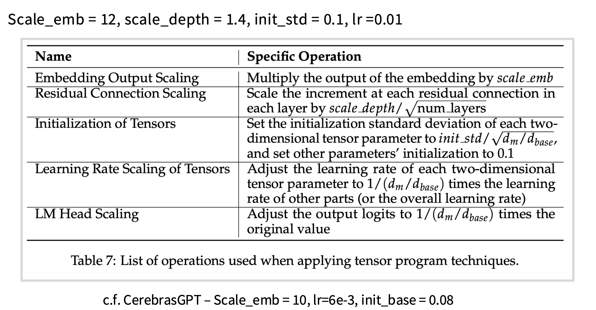

##### Scaling recipe / strategy

Use muP for initialization, fix the aspect ratio, scale up the overall model size.

 aspect ratio 纵横比

##### Optimal batch

Data size and batch, we want to find relation in order to get minimal loss

critical batch size is diminishing return point (临界批量大小大致就是收益递减的拐点)

所以模型变大，loss降低，loss降低就可以使用越来越大的batch size

vertical data size, horizon batch size 也就是说

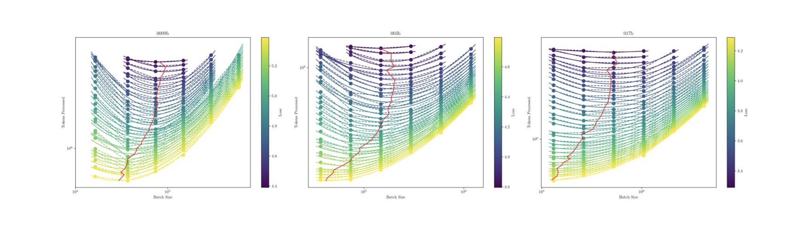

##### Optimal LR

muP Optimal learning rate 是类似的，对于不同的model size

##### solution in miniCPM – WSD learning rate

WSD 就是 **Warmup+Stable+Decay** 来自miniCPM，解决了cosine decay的根本缺陷

* Warm up 让优化器"找到方向"，避免初期大 lr 破坏随机初始化的参数

  ```
  lr = max_lr * (current_step / warmup_steps)
  ```

  - 步数占比极小（~1%）
  - 从接近 0 线性增到 max_lr
  - Adam 的二阶矩估计（$v_t$）在初期不稳定，小 lr 防止梯度爆炸

  **本质：** 优化器冷启动问题，和模型知识无关。

* Stable

  ```
  lr 保持恒定（不衰减！）
           ↓
  模型处于"持续学习"状态
           ↓
  可以随时插入新数据、调整配比
           ↓
  Checkpoint 可以随时 branch 出去做 Decay
  ```

  lr并不是必须衰减才收敛，lr不变loss还是可以下降，只不过比decay后高一点

  模型在持续吸收知识，只是还没"压缩整理"。

  ```
  Stable Checkpoint @ step N
          ├── Branch A: 再跑 10B tokens → Decay → 发布小版本
          ├── Branch B: 换领域数据 → Decay → 领域模型
          └── Branch C: 继续 Stable → 更大版本
  ```


* Decay

  让模型"消化整理"已学到的知识

  ```
  # cosine decay from max_lr to ~0
  lr = max_lr * 0.5 * (1 + cos(π * t / decay_steps))
  ```

  ```
  Stable 阶段：
    参数在高 lr 下持续大幅跳动
    → 探索了大量参数空间
    → 知识"松散"地分布在权重里
  
  Decay 阶段：
    lr 降低 → 更新步长缩小
    → 参数收敛到当前 loss basin 的底部
    → 知识被"压实"进参数
    → Loss 快速下降
  ```

##### WSD example

三个 branch 共享了 50k steps 的训练成本，不需要各自从头跑

```
Step 0                    Step 50k              Step 55k
│                         │                     │
▼                         ▼                     ▼
Warmup ──────────────── Stable ──── ... ──── Stable
                            │
                     Checkpoint @ 50k
                     (这是你的"资产")
                            │
               ┌────────────┼────────────┐
               ▼            ▼            ▼
           Branch A      Branch B      Branch C
           再跑10B        换金融数据     继续跑
           通用数据        Decay         50k步
           → Decay        → 金融模型    → 更强基座
           → v1.0发布

```

但是这里换dataset训会有spike，但是正常

**黄线 Cosine(40N)**：传统余弦调度，从一开始就缓慢弯曲下降，整个训练过程学习率都在变化

**浅绿线 WSD(40N,4N)**：训练40N步，最后4N步做decay，前面全程保持稳定高学习率

**深绿线 WSD(80N,8N)**：训练80N步，最后8N步做decay，**与40N版本共享同一段stable阶段的checkpoint**

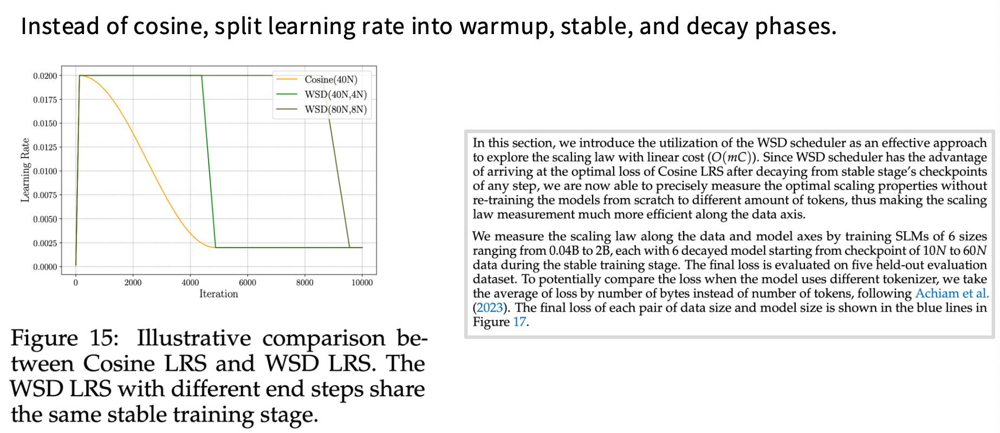

节省算力

最关键的insight是：**两条WSD线共享同一个stable阶段**。这意味着：

- 你只需训练一次stable阶段
- 在不同的checkpoint处触发decay，就能得到"在不同数据量下训练到最优"的模型
- **不需要从头重新训练**来测量scaling law

Cosine LRS 这个得先确定总步数，比如训练100B和200B，就得跑两次完整实验，因为余弦按照总步数比例设计的，WSD的stable阶段是"可复用的"——你只需要保存不同步数的checkpoint，然后各自触发一段decay，就能模拟"在不同数据量下训练到收敛"的效果

##### Side note – other ways of estimating chinchilla curves

scaling law 就是loss有下面三部分组成

**E**：理论下界（不可消除的熵）

**AN^{-α}**：模型太小带来的损失

**BD^{-β}**：数据太少带来的损失

Gadre等人把公式扩展到了**overtraining（过度训练）**场景，引入了参数 **M**（multiplier，倍数）
$$
L(C, M) = E + \left(aM^{\alpha_C} + bM^{-\alpha_C}\right)C^{-\alpha_C}
$$
The overall data-to-model ratio is very high (192), though they argue LLaMA architectures should have a higher ratio. prof说这个比例太高了

#### DeepSeek

##### fanin 和 fanout

对于一个权重矩阵 W，连接 layer l-1 → layer l：

- **fanin** = `n_{l-1}`：输入神经元数量（上一层的宽度）
- **fanout** = `n_l`：输出神经元数量（当前层的宽度）

##### 标准参数化 vs muP 对比

###### 标准参数化（Standard / NTK parametrization）

```
初始化：W ~ N(0, 1/√n_{l-1})
学习率：Θ(1)，即不随宽度变化
```

**问题所在**：当网络变宽（n 变大），forward pass 时激活值会爆炸或消失，因为矩阵乘法会累积误差。

###### muP 参 数化

```
初始化：Θ(1/√n_{l-1} · min(1, √(n_l/n_{l-1})))
学习率：n_l / n_{l-1}（SGD），1/n_{l-1}（Adam）
```

 fanout < fanin，初始化**更小**，防止激活值在这种"压缩"层爆炸

总结了 muP 和标准参数化的两个关键差异：

1. **LR**：Adam 优化器下 LR scaling 不同（标准是 Θ(1)，muP 是 1/n_{l-1}）
2. **初始化**：只有当 fanout < fanin 时初始化才有区别

muP 通过精心设计初始化和 LR 的 scaling 规则，保证**不管网络多宽，每一层的激活值和权重更新幅度都保持稳定**，从而实现超参数从小模型到大模型的迁移。这对 AI Infra 工程师很重要，因为它能大幅节省大模型调参的计算成本。 

# Lec 15

### training data

 FLAN

Oasst

Aplaca

Takeaways on knowledge extraction and alignment

1. You may not want to fine-tune on tail knowledge, even that’s the LM use case（Pretrain 时 tail knowledge 见得少 → 表示很弱、不稳定，Tail knowledge 用 **RAG / tool use** 来补，而不是 fine-tune 进参数里）
2. In principle, ‘RL’ style correctness feedback could help
3. Knowledge storage and extraction in LMs is messy, and nuanced. （知识以分布式、叠加的方式编码在权重里，提取受到 prompt 格式、上下文、语言、temperature 影响，同一个知识，问法不同 → 结果可能完全不同）

pre training 传授知识

post training可以学知识吗？可能可以，但是dataset量不足以支持

### method (How to fine-tune mainly gradient descent)

rollout就是model跑一遍输出

InstructGPT的共识，第一项R(x,y)就是reward，第二项是RL和SFT的kl散度，第三项gamma


On-Policy:   用"当前模型"自己生成的数据来训练自己 

Off-Policy:  用"别人/旧版本"生成的数据来训练

#### PPO

* reward model r_theta(x,y) prompt x, response y, output score

  > 第一项是**在线采样（on-policy）**，这也是 PPO 训练最贵的地方——每次更新参数后都要重新生成 response 来估计期望，这就是为什么后来 GRPO、DPO 想方设法去掉这个在线采样的需求

* RL与STF的KL散度，让RL不要离SFT太远，有beta控制

  β 大 → KL 惩罚强，模型更保守，接近 SFT β 小 → 模型更激进地追求 reward，容易 hacking

  然后这个是token级别的，每个token都计算KL （per-token KL)

* 最后一个是0

```
r_θ(x,y)              想最大化 reward（可能 hacking）
    ↑对抗↓
-β·KL(π_RL||π_SFT)    想让模型别跑太远（保持对齐）

最终平衡点：
reward 高 且 和 SFT 差距不太大 的 response
```

#### DPO (Direct Preference Optimization)

Llama-2-chat

不需要显式训练RM，在用RL优化Actor

对上面的公式直接求最优解，带入loss后把RL转为maximum likelihood problem了

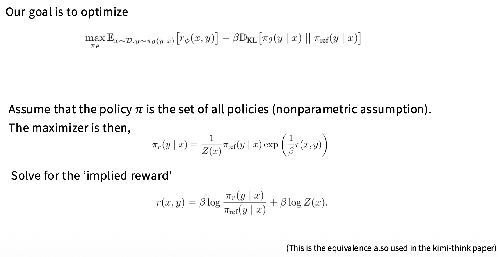

# Lec 16

#### DPO 公式拆解

$$
\nabla_\theta \mathcal{L}_{\text{DPO}} = -\beta \mathbb{E} \Big[ \underbrace{\sigma(\hat{r}_\theta(x, y_l) - \hat{r}_\theta(x, y_w))}_{\text{weight}} \cdot \Big[ \nabla_\theta \log \pi(y_w|x) - \nabla_\theta \log \pi(y_l|x) \Big] \Big]
$$

yl 就是loser不偏好，yw就是winner就是偏好

然后$\sigma$是激活函数！ σ(bad_reward - good_reward) 就是模型当前对这对偏好数据的**"困惑度"**，越困惑 → 梯度越大 → 学习越用力。这让 DPO 自动聚焦在**模型还没学好的样本**上

也就是bad 大，good小这里系数越大，约接近1，所以更新越大

#### GRPO

目前PPO是on policy的，rollout采样很慢 

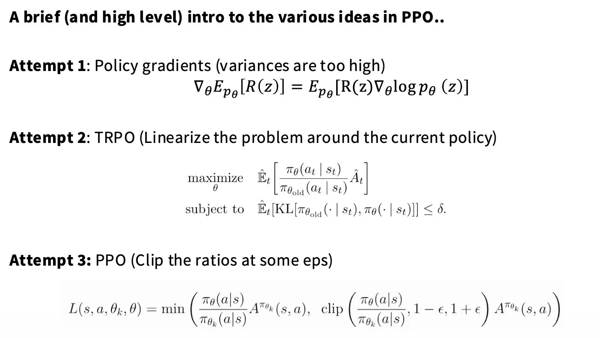

这里为什么要clip呢？为了防止一个action的到了很好的advantage，然后模型拼命增加，防止更新太猛，new policy和old policy差距过大。用clip代替KL约束

ε = 0.2，所以clip范围一般限制在（0.8，1.2）

这里涉及一个Critic，专门用来估计 $V(s)$ 的神经网络，但是Vs没法直接观测，只能用一个actor一样大的模型去你和，所以PPO需要两个大模型

```
Q(s,a)：在状态 s 采取动作 a 之后的期望总回报
V(s)  ：在状态 s 下，平均能拿到多少回报（baseline）

Advantage > 0：这个动作比平均水平好
Advantage < 0：这个动作比平均水平差
```

GRPO就是用组内相对表现代替Vs

对同一个 prompt $x$，采样 $G$ 个输出：
$$
\{y_1, y_2, y_3, ..., y_G\} \sim \pi_\theta(\cdot | x)
$$
每个输出得到 reward：
$$
\{r_1, r_2, r_3, ..., r_G\}
$$
然后组内归一化：
$$
\hat{A}_i = \frac{r_i - \text{mean}(\mathbf{r})}{\text{std}(\mathbf{r})}
$$
mean(r) 本身就充当了 baseline（即 V(s) 的估计）

原本PPO Actor 7B，Critic 7B，RM 7B，Ref 7B = 14*4=56GB

GRPO 少了Critic = 42GB 

* Compute reward for each rollout

* Mean/Var normalization per group

* Compute KL term

* Gradient updates on the loss

https://github.com/McGill-NLP/nano-aha-moment

1e-4 防止梯度爆炸

### case study

#### DeepSeek R1

主要讲了CoT

#### Kimi K1.5

##### data curation+SFT

Standard curation across math-style settings, balancing topics 有一个LLM的自动化标签系统，分类平衡

Exclude multiple choice / true false (false positives) too easy to hack or guess，不要选择和判断

Select only examples that models fail on best-of-8 用不reasoning的model也就是SFT模型产生10个答案，根据答案决定是否采纳示例

> GRPO 训练需要 Group 内有**对有错**才能产生有效的 advantage 信号：
>
> - 全对 → advantage 全为 0 → 梯度为 0 → 白费
> - 全错 → 没有正向信号 → 模型学不到什么
> - **有对有错 → 对比信号最强 → 训练最有效**
>
> **留下 SFT model 偶尔会错的题**，这类题对 RL 训练的信噪比最高。太简单的题产生不了有效梯度，直接丢掉节省算力。

##### RL

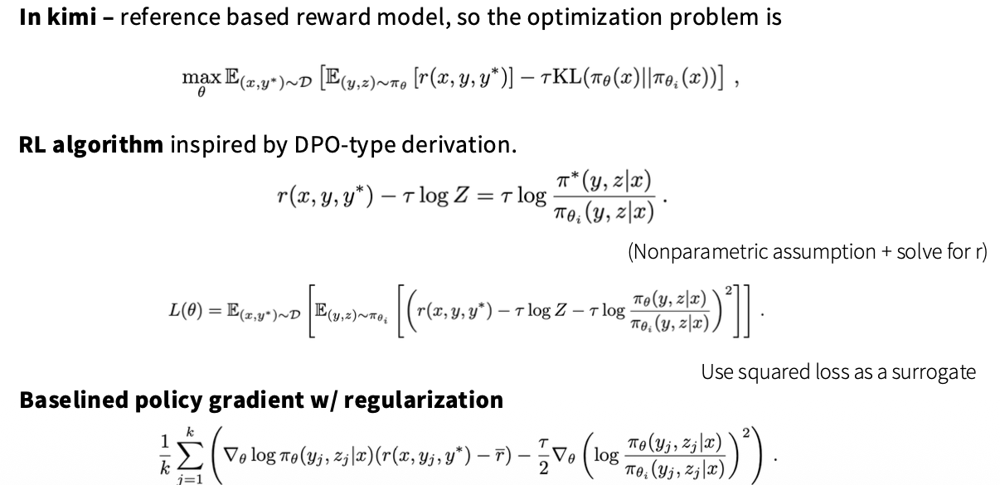

第一部分是base r就是均值，第二部分不是clip（GRPO）而是规范化策略？

##### Length control

lambda = 0.5-(len(i)-min_len)/(max_len-min_len) range from [-0.5, 0.5]

##### RL Infra

On policy = rollouts, which means (slow) inference （核心的bottleneck，rollout）

Switching from training to rollouts often means different frameworks （RL和inference switch，passing data back to RL, RL pass weight to inference server)

Long CoTs can make batches very uneven.

rollout（推理采样）→ 计算reward → 训练更新 → 再rollout → ...

朴素做法是训练和推理用**不同的 GPU 集群**，但这样资源利用率低——训练时推理卡闲着，推理时训练卡闲着。

Kimi 的方案是**同一批 GPU 交替跑 Megatron（训练）和 vLLM（推理）**，但两者的内存布局完全不同，不能同时驻留显存。

```
[Training Phase]
  Megatron 训练
  → 训练完成，offload 权重到 CPU
  → 等待 vLLM rollout

[Inference Phase]
  vLLM 用 dummy weights 启动（占位）
  → 从 Megatron 拿最新权重（via Mooncake/RDMA）
  → Update weight，开始 rollout 采样
  → rollout 完成，terminate vLLM，释放显存

[Subsequent Training Phase]
  Megatron onload 权重回 GPU
  → 开始下一轮训练
```

**Checkpoint Engine（shim 进程）**

- 同时被 Megatron 和 vLLM 两侧持有
- 负责协调权重的 Register / Update / Shared Memory 操作
- 是两个容器之间的**桥梁进程**

**Shared Memory**

- Megatron offload 后权重先落到 Shared Memory
- vLLM 从这里读取最新权重做 Update Weight
- 避免走网络，同节点内零拷贝

**RDMA + etcd**

- 跨 Pod 的权重传输走 RDMA（高带宽低延迟）
- etcd 做服务发现和状态同步，协调多个 Pod 的进度

**Mooncake**

- Kimi 自研的传输层，负责大规模权重的高效搬运

**Dummy Start**

- vLLM 启动时先用 dummy（随机/空）权重占好显存
- 等 Megatron 传过来真实权重再 Update
- 避免 vLLM 冷启动的显存分配延迟

> 训练阶段：  Megatron 占用全部 GPU 显存  vLLM 进程存在，但显存已释放（不占显存） 推理阶段：  Megatron offload 到 CPU → GPU 显存释放  vLLM 重新申请显存 → 加载新权重 → rollout
>
> Megatron 训练完成  ↓ 开始 offload 权重到 CPU        ──┐ 同时：vLLM 开始申请显存(dummy)  ──┘  并行进行！ offload 完成 + vLLM 显存ready  ↓ 权重通过 Shared Memory/RDMA 传给 vLLM  ↓ vLLM 覆写显存中的 dummy 权重 → rollout
>
>  也就是offload和vllm initial可以并行，dummy start
>
> offload是分批次的，offload完再free，再vllm申请这块free的空间，填dummy权重，但是需要cuda异步内存操作
>
>  ````
>  cudaMemcpyAsync(cpu_buf, gpu_buf, size, D2H, stream1)
>  // stream1 在传输，stream2 可以同时做别的事情
>  // 传输完成后 callback：free gpu_buf，通知 vLLM 可以申请
>  ````

#### Qwen 3

thinking mode fusion, think and no think tag

So this tag can control thinking token

# Lec 17


# RL

SFT的本质是什么？SFT 的 loss 和 pre-training **完全一样**，都是 cross-entropy

```
Pretraining        SFT              RLHF/DPO
────────────       ──────────       ──────────────────
构建特征空间         激活 IF 行为      精细化 preference
注入世界知识         格式对齐          拒绝有害输出
学习语言分布         少量数据够用      需要更多覆盖度
                    泛化靠 pretrain   泛化靠 reward model

                         ↓
              最终泛化能力的上限 = Pretrain 的质量
Loss: next token    Loss: supervised    Loss: reward signal
prediction          imitation
```

```python
# Pre-training: 对所有 token 都算 loss
loss = CrossEntropy(logits, all_tokens)

# SFT: 只对 response 部分算 loss（input/instruction 部分 mask 掉）
loss = CrossEntropy(logits, response_tokens_only)
#                                ↑
#              这是 SFT 和 pre-training 最核心的区别
# [INST] 帮我写一个排序算法 [/INST]  →  这段 mask，不算 loss
# 这是一个冒泡排序...                →  这段算 loss，监督模型输出
```

 SFT 并不是在"教模型新知识"，而是在 reshape 模型的输出分布

SFT做了什么，从续写变到指令

```
Before SFT:
  Input:  "写一首诗"
  Output: "写一首诗的技巧有很多，首先..." （续写风格）

After SFT:
  Input:  "写一首诗"
  Output: "春风吹绿江南岸..."             （执行指令）
```

缩小输出空间，Pre-training 学到的是**整个互联网的分布**（广但杂），SFT 用高质量 demo 把分布**拉向特定行为空间**

```
Pre-training 分布:
  P(output | input) ← 覆盖所有可能的"合理续写"

SFT 之后:
  P(output | input) ← 向 demonstration 数据的分布靠拢
                       （helpful, formatted, role-aware）
```

激活已有能力

**模型的能力在 pre-training 就已经学会了**，SFT 只是教模型"什么时候、用什么格式把能力表现出来"。

这也是为什么少量高质量 SFT 数据（1k~10k 条）就能显著改变模型行为的原因。

SFT里数据质量是核心

#### SFT 的局限性（为什么还需要 RLHF）

| 问题                      | 原因                                           |
| ------------------------- | ---------------------------------------------- |
| **Behavior cloning 上限** | 模型只能模仿 demo，无法超越 demonstration 质量 |
| **分布外泛化差**          | 没见过的指令格式容易失效                       |
| **无法优化"好坏"**        | SFT 不知道两个回答哪个更好，只是 imitation     |
| **Reward hacking 风险**   | 模型学会"看起来像好答案"而不是"真的是好答案"   |

这就是为什么 SFT 之后还需要 **RLHF/RLAIF**：

```
SFT:  "模仿人类写的答案"
RLHF: "优化人类更喜欢哪个答案"  ← 有质量信号的反馈
```

```
# 关键超参数
learning_rate = 1e-5 ~ 5e-5   # 比 pre-training 小 10-100x
                                # 防止 catastrophic forgetting
epochs = 1 ~ 3                 # 太多会过拟合 demo 数据
warmup + cosine decay          # 标准 LR schedule

# 常用技术
LoRA / QLoRA    # 只微调低秩矩阵，参数量降低 100x+
Gradient ckpt   # 节省显存
Flash Attention # 长 context 必备
```

FFT & PEFT

少量数据更新

```
# 模型所有参数都参与梯度计算和更新
for name, param in model.named_parameters():
    param.requires_grad = True   # 全部解冻

optimizer = AdamW(model.parameters(), lr=2e-5)

# 前向传播
output = model(input_ids, attention_mask)
loss = cross_entropy(output.logits, labels)  # 只对 response token 算

# 反向传播 → 更新所有权重
loss.backward()
optimizer.step()
```

7B model fp16 7B*2bytes=14GB, activation 7B\*2bytes=14GB, AdamW 7B\*(4+4)=56GB, total 84GB Adam 优化器是显存杀手

一个 epoch 大概率够了，但原因反直觉

```
Pre-training:   epoch 很多，因为要从随机初始化"学会"一切
FFT:            模型已有强大先验，只需要"激活/调整"行为
```

PEFT **预训练模型做任务适应时，权重的变化是低秩的（low intrinsic rank）** —— LoRA 论文（Hu et al. 2021）

FFT 时虽然所有参数都在动，但**有效的信息变化维度很低**，大量更新是冗余的

```
FFT:   W_new = W_0 + ΔW
              其中 ΔW ∈ R^(d×k)，参数量 = d×k

LoRA:  W_new = W_0 + BA
              其中 B ∈ R^(d×r), A ∈ R^(r×k)，r << min(d,k)
              参数量 = d×r + r×k = r(d+k)

压缩比：
  d=4096, k=4096, r=16
  FFT:  4096 × 4096 = 16,777,216 参数
  LoRA: 16 × (4096+4096) = 131,072 参数
  → 压缩 128x
```

d*k

d*r+r\*k = (d+k)\*r

```python
#TODO 手搓一个LoRA
import torch
import torch.nn as nn

class LoRALinear(nn.Module):
    def __init__(self, original_linear, r=16, alpha=32):
        super().__init__()
        d, k = original_linear.weight.shape
        self.original = original_linear
        self.r = r
        self.scale = alpha / r           # scaling factor

        # 冻结原始权重
        for p in self.original.parameters():
            p.requires_grad = False

        # 只训练这两个小矩阵
        self.A = nn.Parameter(torch.randn(r, k) * 0.01)  # 随机初始化
        self.B = nn.Parameter(torch.zeros(d, r))          # 零初始化 ← 关键！

    def forward(self, x):
        # W_0·x  +  (B·A)·x × scale
        return self.original(x) + (x @ self.A.T @ self.B.T) * self.scale

# B 初始化为 0 的原因：
# 训练开始时 ΔW = B·A = 0，不破坏预训练模型的输出
# 相当于从一个"干净"的起点开始微调
```

LoRA加在哪里？ Wq，Wk，Wv，Wo

QLoRA：显存再砍一半

```
LoRA:  fp16 加载模型权重 + 训练 LoRA 矩阵
QLoRA: NF4 量化加载模型权重 + fp16 LoRA 矩阵 + 计算时动态反量化

7B 模型显存对比：
  FFT:    ~84 GB
  LoRA:   ~30 GB
  QLoRA:  ~10 GB  ← 单张 3090/4090 可跑！
```

Learning Rate

```
Pre-training LR:  1e-4 ~ 3e-4
SFT LR:           1e-5 ~ 5e-5   (小 10-100x)

原因 —— Loss landscape 视角：

Pre-training 后模型已在一个"好的"loss 谷底
                    ↓
SFT 数据量小，大 LR 会把模型踢出谷底
                    ↓
            灾难性遗忘 (Catastrophic Forgetting)
            模型忘记 pre-training 学到的知识

小 LR = 在谷底附近小步调整，不破坏已有能力
```

Warmup + Cosine Decay：LR Schedule

```
def get_lr(step, total_steps, warmup_steps, max_lr, min_lr):
    # Phase 1: Linear Warmup
    if step < warmup_steps:
        return max_lr * (step / warmup_steps)

    # Phase 2: Cosine Decay
    progress = (step - warmup_steps) / (total_steps - warmup_steps)
    return min_lr + 0.5 * (max_lr - min_lr) * (1 + cos(π * progress))

# 为什么 warmup？
# 训练初始梯度不稳定，直接大 LR 会震荡
# warmup 让优化器先"热身"，积累可靠的梯度统计
```

Gradient Checkpointing：时间换空间

```
正常前向传播：保存所有中间激活值（用于反向传播）
  显存：O(层数)  速度：快

Gradient Checkpointing：只保存关键节点的激活值，其余重算
  显存：O(√层数)  速度：慢约 30-40%

# 开启方式
model.gradient_checkpointing_enable()
```

Flash Attention：计算重构

```
标准 Attention 瓶颈：
  QK^T 矩阵：(seq_len × seq_len)，长序列时爆显存
  seq=4096: 4096×4096×2bytes ≈ 32MB（每层每头）

Flash Attention 思路：
  分块计算（tiling），避免具现化完整 attention 矩阵
  IO-aware：最大化利用 SRAM，减少 HBM 读写
  
效果：
  显存 O(n²) → O(n)
  速度提升 2-4x（IO bound 变 compute bound）
```

SFT 使用框架 LLaMA-Factory  支持几乎所有开源模型，配置驱动，工业常用


policy + reward

SFT（监督微调）→ GRPO（数学推理 RL）→ DPO（可选，偏好对齐）

RLHF (InstructGPT) SFT->RM->PPO reward 人类偏好

DPO 绕开 reward model直接从偏好数据学更稳定简单

RLVR / GRPOreward = 答案对/错无需人类标注DeepSeek-R1 核心

**Agent（智能体）**：做决策的主体。在 LLM 场景里，模型本身就是 agent。

**Environment（环境）**：agent 交互的世界。在 LLM 场景里，"环境"是人类或自动评分系统。

**State s（状态）**：当前的观测。对 LLM 来说，状态 = 当前的 prompt + 已生成的 token。

**Policy π(a|s)（策略）**：给定状态，选择动作的概率分布。LLM 的 policy 就是 `P(下一个token | 之前所有token)`，也就是模型本身。

**Reward r（奖励）**：做完动作后得到的反馈信号。这是 RL 和监督学习最本质的区别——reward 可以很稀疏，可以延迟，可以来自人类打分，也可以来自程序验证。

### alignment (InstructGPT)

**第一阶段 SFT（监督微调）**：收集人类写的好回答，用监督学习微调模型。告诉模型"这种风格是好的"。

**第二阶段 RM（奖励模型）**：让人类对多个回答排序，训练一个 reward model 来预测人类偏好分数。相当于把人类偏好"固化"成一个打分函数。

**第三阶段 PPO（强化学习）**：用 RM 的分数作为 reward，用 PPO 算法继续训练 LLM。模型通过不断生成→评分→更新，学会输出更符合人类偏好的回答。

RLHF 有个痛点：**reward model 本身可能训偏**。模型会学会"哄骗" reward model（reward hacking），而不是真正变好。而且训练 RM 需要大量人类标注，成本很高，需要同时维护 4 个模型（SFT, RM, Actor, Ref）训练不稳定，reward hacking工程复杂度极高

GRPO/RLVR reward 来自"数学答案对不对"这种程序可以自动验证的信号，不需要人类打分，也不需要 reward model，干净得多

DPO 只需 2 个模型（π\_θ, π\_ref）训练稳定，无 RL 波动一个 loss 函数搞定实现极简，效果接近

### Generalization

学知识是在pretrain里，SFT是激活，路由，格式化pretrain学习到的能力

即 instruction-following 的 surface behavior

```
Layer 1：特征空间已经构建好了
Pretrain 之后，模型的 representation space 已经把语义、知识、推理都编码进去了。
SFT 的 gradient update 主要在：

调整 attention 的 routing（哪些 head 被激活）
调整输出层的分布（从 next-token prediction 转向 instruction following）
不怎么改动中间层的知识表示

Layer 2：泛化来自 Pretrain 的 in-context generalization
Pretrain 见过海量的 QA 对、对话、指令文本（StackOverflow、Reddit、书籍...），只是没有经过 instruction-following 的 alignment。
SFT 相当于给模型一把钥匙，让它知道"遇到这种输入格式，激活对话模式"。

Layer 3：数据质量 >> 数量
泛化的关键不是数据量，而是覆盖行为空间的多样性：
```


https://claude.ai/share/27f8294b-852d-436a-9f8f-7687dfb107e1

```
可以做的 MLsys 研究：

① CUDA Kernel 优化
   写 FlashAttention / Fused Kernels
   显存大小不是关键，理解内存层级才是
   4060 一样有 L1/L2/SMEM/HBM 层级
   sm_89 架构，完全够学习

② 量化 (Quantization)
   INT8 / INT4 / GPTQ / AWQ 实现
   在小模型上验证方法，结论可以迁移到大模型

③ 推理引擎
   KV Cache 优化, Continuous Batching
   PagedAttention (vLLM 核心思想)
   可以在小模型上完整复现

④ 编译优化
   Triton 写算子
   torch.compile 的行为分析
   这些跟显存大小关系不大
```


# LMs

### evaluate

现代大模型训练几乎从一开始就不是 FP32 了，而是forward / backward 用 FP16 或 BF16，optimizer 里关键状态才用 FP32。

Example: the 4B model

the model size bf16/fp16 is 4B*2B = 8G （total 8G)

full fine-tuning grad: assume grad type  bf16/fp16 4B* 2B = 8G  （total 8G)

if use Adam/AdamW Optimizer, Adam 有两个一阶/二阶动量， m（一阶矩），v（二阶矩），都是fp32的，4B\*4B+4B\*4B = 32G，这是 full finetune 显存爆炸的核心原因，同时Adam/AdamW同时也会维护一份FP32 master params = 4B × 4B = 16 GB，用来更新权重，更新完再cast回FP16参数 （total 48G)

Activation：和 batch size / seq len 强相关，Transformer 每层 activation 大致 ≈ `O(hidden_size × seq_len × batch)`，对 4B 模型来说activation 通常 ≥ 参数大小 8–16 GB

**（total 72–80+ GB）**


FF layers use SwiGLU, not ReLU

## Pre-vs-post norm


If putting LayerNorms in residual streams is bad.. Why not post-norm outside the stream?

## LayerNorm vs RMSNorm


## Perplexity

“困惑率”（**Perplexity, PPL**）是衡量语言模型预测能力的一个经典指标，尤其在 **概率语言模型和 LLM** 中用得非常广泛

假设模型给定一个序列 $x_1, x_2, \dots, x_N$，语言模型会计算条件概率：
$$
P(x_1, x_2, \dots, x_N) = \prod_{t=1}^{N} P(x_t \mid x_1, \dots, x_{t-1})
$$
**困惑率**定义为：
$$
\text{PPL} = \exp \left( - \frac{1}{N} \sum_{t=1}^{N} \log P(x_t \mid x_1, \dots, x_{t-1}) \right)
$$
或者等价地：
$$
\text{PPL} = 2^{H}, \quad H = \text{交叉熵}
$$
PPL 越小 → 模型越“自信” → 预测越准确

PPL 越大 → 模型越“困惑” → 预测不确定性高

# Experiment

```python
uv run python
```

`uv run python` ≠ “运行当前环境里的 python”，它是在“临时构造一个可复现的 Python 运行环境”

### Mixed precision

```python
if use_mixed_precision and device == 'cuda':
    autocast_context = torch.autocast(
        device_type='cuda',
        dtype=torch.bfloat16
    )
else:
    autocast_context = nullcontext()
```

在 CUDA 上开启 AMP（Automatic Mixed Precision），让 PyTorch 自动把“适合的算子”降精度到 BF16 计算

```python
with autocast_context:
    output = model(input)
```

**forward 内部的算子会被自动 cast 到 BF16 或 FP32**

你**不用手动 `.half()` / `.bfloat16()` 每个 tensor**

# Flash Attention V1,2,3 Difference

| 版本   | 核心特点                                            | Memory Usage                     | 支持特性                                         | 优化方式                                                     |
| ------ | --------------------------------------------------- | -------------------------------- | ------------------------------------------------ | ------------------------------------------------------------ |
| **V1** | 原始 FlashAttention（Triangular masked softmax）    | **O(N×D)**，存储 QK^T            | 支持 causal mask                                 | 利用 **tiling + shared memory**，减少全矩阵 QK^T 的存储，softmax 在 tile 内计算 |
| **V2** | 支持 **arbitrary seq_len** 和 **multi-head fusion** | 更低，部分中间结果不落显存       | 支持 variable sequence lengths，multi-head batch | **kernel fusion** + **streaming softmax**，避免全局 QK^T     |
| **V3** | 最新版本，性能最优                                  | 最低，几乎只保留 tile 内必要数据 | 支持 **kv cache, checkpointing**, 更灵活 batch   | **pipelined tiling + async copy + fused GEMM + incremental softmax**，几乎消除了 memory bandwidth 瓶颈 |

### V1

目标：解决原生 PyTorch attention 的 O(N²) 显存问题。

方法：按 block（tile）计算 QK^T，softmax 在 tile 内归一化。

限制：只能处理固定 seq_len，multi-head 不够灵活。

### V2

改进了 **variable sequence length** 支持。

对 multi-head batch 做 kernel fusion，减少 kernel launch。

softmax 的归一化采用 streaming 方式，避免一次性存全矩阵。

### V3

专为 **大模型推理** 和 **kv cache** 设计。

使用 **pipelined tiling + async copy** 技术，把计算和内存访问 overlap。

incremental softmax：记录每个 tile 的 max value 和 sum，保证全局归一化。

几乎把 memory bandwidth 限制降到最低，速度最优。

# Nano-vllm

```python
from nanovllm import LLM, SamplingParams

"""
will inherit from LLMEngine
"""
class LLM(LLMEngine):
  pass
```

# Cuda Graph

https://developer.nvidia.com/blog/cuda-graphs/

在 CUDA 中，每次 GPU 计算都是通过 **kernel launch** 或 **memory copy** 提交给 GPU 执行的。每次提交都会有 **CPU → GPU 的调度开销**（launch overhead）。当有大量小 kernel 时，这个开销可能非常显著。

将一系列 GPU 操作（kernel、memcpy、events 等）预先捕获成一个“图”，然后一次性提交给 GPU 执行，避免每次提交的调度开销。

* Kernel 节点：GPU kernel 执行

* Memcpy 节点：内存拷贝（Host→Device, Device→Device 等）

* Event 节点：同步

* Empty 节点：占位，用于依赖关系管理

```
Host -> MemcpyH2D -> KernelA -> KernelB -> MemcpyD2H
```

**减少 CPU 调度开销**

- 普通模式：每次 kernel launch 都要 CPU 提交到 GPU → launch overhead。
- CUDA Graph：一次记录，多次执行，CPU 不再参与调度。

**优化依赖调度**

- 图中已经把 kernel 依赖关系明确表示，GPU 内部可以并行调度而无需 CPU 干预。

**批量内存操作优化**

- memcpy 也可以纳入图中，减少多次调用的开销。

**典型场景**

- Transformer 模型推理（很多小矩阵乘法 kernel）

  - LLM每次generate token will have multuple GEMM (q,k,v projection + MLP + attention) 多次生成 token 速度可提升 10%~30%

  ```python
  graph = torch.cuda.CUDAGraph()
  with torch.cuda.graph(graph):
      output = model(input_ids)
  graph.replay()
  ```

- 小 batch 大量迭代训练

- GPU kernels 较多、每个 kernel launch 开销显著时

**微批量训练（微调 LoRA / PEFT）**

- 将前向 + 后向 + optimizer step 整个微批量图化
- 重复 replay 多次 step
- GPU 利用率提高，CPU 调度几乎为零

**Graph 一旦实例化，节点形状和类型必须固定**

- 比如输入 batch size、tensor shape 必须保持一致
- 对于可变 batch，需要为每种 batch size 分别实例化 graph

**不支持动态 Python 逻辑**

- 例如 `if` 条件会导致不同 kernel sequence，这种情况需要用静态图或多图实例化

**调试困难**

- 一旦出错，graph replay 可能崩溃，需要先在普通模式下调试


```c++
kernel<<<gridDim, blockDim, sharedMemBytes, stream>>>(args...)
```

| 位置 | 参数      | 作用                              |
| ---- | --------- | --------------------------------- |
| 1    | `blocks`  | gridDim：有多少个 block           |
| 2    | `threads` | blockDim：每个 block 有多少个线程 |
| 3    | `0`       | 动态共享内存大小（字节）          |
| 4    | `stream`  | 使用的 CUDA stream                |

# MLE

maximum likelihood 

Cross Entropy Loss 和 MLE 是同一件事

```
最大化 log P(data | θ)
    ≡
最小化 -log P(data | θ)
    ≡
最小化 Cross Entropy Loss
```

DPO 的 loss 本质上也是一个 MLE，只是在"偏好对"上做的：
$$
\mathcal{L}_{DPO} = -\log \sigma \left( \beta \log \frac{\pi_\theta(y_w|x)}{\pi_{ref}(y_w|x)} - \beta \log \frac{\pi_\theta(y_l|x)}{\pi_{ref}(y_l|x)} \right)
$$

## InstructGPT

- Abstract + Introduction（搞清楚 SFT → RM → PPO 三阶段）
- Section 3.1（SFT 数据和训练方式）
- Figure 2（整体流程图，看懂这张图就理解了 RLHF 全貌）
- 可以跳过 Section 4-5 的实验细节
